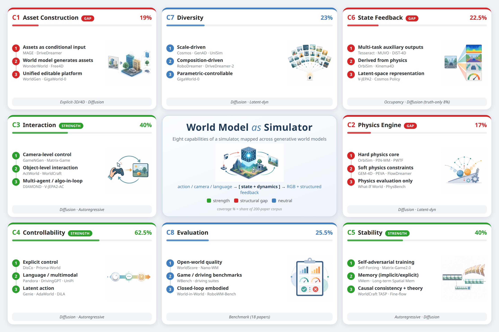
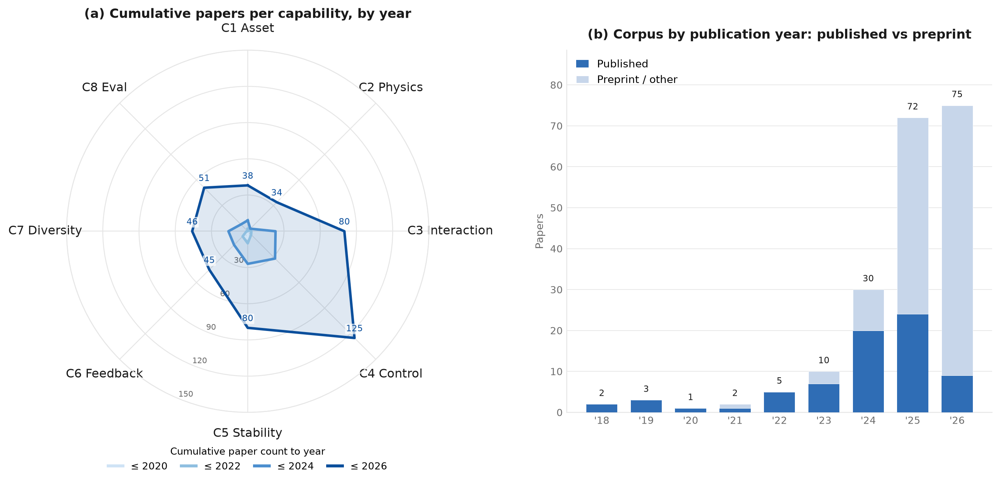

# Awesome-World-Model-Simulators [](https://github.com/sindresorhus/awesome)

A curated list of resources on generative world models as simulators, based on the comprehensive survey "From Generation to Simulation: How Far Are World Models from Being True Simulators?" The corpus contains 200 papers published between 2018 and 2026 and is organized using eight capabilities of traditional simulators.



## News🔥

* **[2026/08/24]** Initial release of the Awesome-World-Model-Simulators repository.
* **[2026/06/30]** Literature search closed with a corpus of 200 papers.

## Contact

If you have suggestions, corrections, or new papers to recommend, please open a GitHub issue or submit a pull request.

If this list helps your research, please ⭐ and cite:

```bibtex
@article{wang2026generation,
  title={From Generation to Simulation: How Far Are World Models from Being True Simulators?},
  author={Wang, Tong and Deng, Huan and Yang, Mucheng and He, Yang and Kuang, Xiaohui and Zhao, Gang},
  journal={Manuscript},
  year={2026}
}
```

## Table of Contents 🍃

* [Roadmap of world models as simulators](#roadmap-of-world-models-as-simulators)
* [1 Asset Construction](#1-asset-construction)
    * [C1 Assets as Conditional Input (6)](#c1-assets-as-conditional-input-6)
    * [C1 Asset Generation by World Models (32)](#c1-asset-generation-by-world-models-32)
* [2 Physics Engine](#2-physics-engine)
    * [C2 Hard Physics (4)](#c2-hard-physics-4)
    * [C2 Soft Constraints (26)](#c2-soft-constraints-26)
    * [C2 Physical Evaluation (4)](#c2-physical-evaluation-4)
* [3 Interaction](#3-interaction)
    * [C3 The Object of Interaction (51)](#c3-the-object-of-interaction-51)
    * [C3 The Depth of Interaction (29)](#c3-the-depth-of-interaction-29)
* [4 Controllability](#4-controllability)
    * [C4 Explicit Control (89)](#c4-explicit-control-89)
    * [C4 Language and Multimodal Control (24)](#c4-language-and-multimodal-control-24)
    * [C4 Latent Actions (12)](#c4-latent-actions-12)
* [5 Stability](#5-stability)
    * [C5 Self-Adversarial Training (4)](#c5-self-adversarial-training-4)
    * [C5 Implicit and Explicit Memory (12)](#c5-implicit-and-explicit-memory-12)
    * [C5 Causal Consistency (52)](#c5-causal-consistency-52)
    * [C5 Quantification of Drift and Theoretical Guarantees (12)](#c5-quantification-of-drift-and-theoretical-guarantees-12)
* [6 State Feedback](#6-state-feedback)
    * [C6 Multi-Task Auxiliary Output (32)](#c6-multi-task-auxiliary-output-32)
    * [C6 Deriving Structured State from Physical Simulation (6)](#c6-deriving-structured-state-from-physical-simulation-6)
    * [C6 Latent Representation as Alternative Feedback (4)](#c6-latent-representation-as-alternative-feedback-4)
    * [C6 The Missing Ground-Truth Feedback (3)](#c6-the-missing-ground-truth-feedback-3)
* [7 Diversity](#7-diversity)
    * [C7 Scale-Driven Diversity (28)](#c7-scale-driven-diversity-28)
    * [C7 Composition-Driven Diversity (7)](#c7-composition-driven-diversity-7)
    * [C7 Controllable Parametric Diversity (6)](#c7-controllable-parametric-diversity-6)
    * [C7 Theoretical Insight and Missing Evaluation of Diversity (5)](#c7-theoretical-insight-and-missing-evaluation-of-diversity-5)
* [8 Evaluation Metrics](#8-evaluation-metrics)
    * [C8 Unified Generation-Quality Evaluation (22)](#c8-unified-generation-quality-evaluation-22)
    * [C8 Closed-Loop Embodied Evaluation (24)](#c8-closed-loop-embodied-evaluation-24)
    * [C8 Physical-Plausibility Evaluation (5)](#c8-physical-plausibility-evaluation-5)
    * [Four Structural Gaps](#four-structural-gaps)
* [9 Surveys](#9-surveys)
    * [General World Models (3)](#general-world-models-3)
    * [Autonomous Driving (4)](#autonomous-driving-4)
    * [Robotics and Embodied Intelligence (5)](#robotics-and-embodied-intelligence-5)
    * [Interactive Video World Models (1)](#interactive-video-world-models-1)
    * [Efficiency and Multidimensional Generation (3)](#efficiency-and-multidimensional-generation-3)

## Roadmap of world models as simulators



The eight sections below form a capability-based index. A paper appears in every section to which it makes a principal contribution; consequently, entries may occur in more than one section. Within each capability, papers are grouped by the concrete analytical categories used in the survey rather than by technical route. The dedicated survey section provides a topical index of all review papers.

## 1 Asset Construction

Controllable creation, composition, and editing of maps, objects, characters, materials, and persistent 3D/4D assets. **38 papers** in the corpus make this a principal contribution.

### C1 Assets as Conditional Input (6)

| Title | Pub. & Date | Code/Project URL |
| --- | --- | --- |
| [VerseCrafter: Dynamic Realistic Video World Model with 4D Geometric Control](https://arxiv.org/pdf/2601.05138) | arXiv 2026 | [](https://github.com/TencentARC/VerseCrafter) |
| [Prisma-World: Camera-Controllable Multi-Agent Video World Model](https://arxiv.org/pdf/2606.09507) | arXiv 2026 | [](https://github.com/huiqiang-sun/Prisma-World) |
| [MAGICITY4D: Controllable and Editable 4D City Scene Generation Using MLLM-Enhanced Procedural Content Generation](https://doi.org/10.1109/icassp55912.2026.11464740) | ICASSP 2026 | [](https://erxucomeon.github.io/MagiCity) |
| [BridgeV2W: Bridging Video Generation Models to Embodied World Models via Embodiment Masks](https://arxiv.org/pdf/2602.03793) | arXiv 2026 | [](https://BridgeV2W.github.io) |
| [MagicDrive: Street View Generation with Diverse 3D Geometry Control](https://arxiv.org/pdf/2310.02601) | ICLR 2024 | [](https://github.com/cure-lab/MagicDrive) |
| [DriveDreamer: Towards Real-world-driven World Models for Autonomous Driving](https://arxiv.org/pdf/2309.09777) | ECCV 2024 | [](https://github.com/JeffWang987/DriveDreamer) |

### C1 Asset Generation by World Models (32)

| Title | Pub. & Date | Code/Project URL |
| --- | --- | --- |
| [Xiaomi Auto World Model: A Joint World Model Integrating Reconstruction and Generation for Autonomous Driving](https://arxiv.org/pdf/2605.18137) | arXiv 2026 | [](https://JointWM.github.io) |
| [Towards Dynamic World Model Generation with Monocular Video](https://doi.org/10.1109/icassp55912.2026.11463651) | ICASSP 2026 | — |
| [NeoVerse: Enhancing 4D World Model with in-the-wild Monocular Videos](https://arxiv.org/pdf/2601.00393) | arXiv 2026 | [](https://neoverse-4d.github.io) |
| [MoVerse: Real-Time Video World Modeling with Panoramic Gaussian Scaffold](https://arxiv.org/pdf/2606.13376) | arXiv 2026 | [](https://github.com/Orange-3DV-Team/MoVerse) |
| [Lyra 2.0: Explorable Generative 3D Worlds](https://arxiv.org/pdf/2604.13036) | arXiv 2026 | [](https://github.com/nv-tlabs/lyra) |
| [GEM-4D: Geometry-Enhanced Video World Models for Robot Manipulation](https://arxiv.org/pdf/2605.22882) | arXiv 2026 | [](https://gem-4d.github.io/) |
| [Future Dynamic 3D Reconstruction: A 3D World Model with Disentangled Ego-Motion](https://arxiv.org/pdf/2606.18250) | arXiv 2026 | [](https://fr3d-wm.github.io) |
| [DecMem: Towards Minute-Long Consistent World Generation with Decoupled Memory](https://arxiv.org/pdf/2605.31336) | arXiv 2026 | [](https://github.com/KlingAIResearch/DecMem) |
| [CP4D: Compositional Physics-aware 4D Scene Generation](https://arxiv.org/pdf/2606.09187) | arXiv 2026 | [](https://anonymous.4open.science/w/CP4D/) |
| [Comp4D: Compositional 4D Scene Generation](https://doi.org/10.1109/wacv61042.2026.00348) | WACV 2026 | [](https://github.com/VITA-Group/Comp4D) |
| [3D4D: An Interactive, Editable, 4D World Model via 3D Video Generation](https://arxiv.org/pdf/2511.08536) | AAAI 2026 | [](https://yunhonghe1021.github.io/NOVA/) |
| [WorldGen: From Text to Traversable and Interactive 3D Worlds](https://arxiv.org/pdf/2511.16825) | arXiv 2025 | [](https://www.meta.com/blog/worldgen-3d-world-generation-reality-labs-generative-ai-research/) |
| [WonderWorld: Interactive 3D Scene Generation from a Single Image](https://arxiv.org/pdf/2406.09394) | CVPR 2025 | [](https://github.com/KovenYu/WonderWorld) |
| [Video World Models with Long-term Spatial Memory](https://arxiv.org/pdf/2506.05284) | arXiv 2025 | [](https://spmem.github.io/) |
| [UniScene: Unified Occupancy-centric Driving Scene Generation](https://arxiv.org/pdf/2412.05435) | CVPR 2025 | [](https://github.com/Arlo0o/UniScene-Unified-Occupancy-centric-Driving-Scene-Generation) |
| [TesserAct: Learning 4D Embodied World Models](https://arxiv.org/pdf/2504.20995) | ICCV 2025 | [](https://TesserActWorld.github.io) |
| [RoboScape: Physics-informed Embodied World Model](https://arxiv.org/pdf/2506.23135) | arXiv 2025 | [](https://github.com/tsinghua-fib-lab/RoboScape) |
| [PlayerOne: Egocentric World Simulator](https://arxiv.org/pdf/2506.09995) | NeurIPS 2025 | [](https://github.com/yuanpengtu/PlayerOne) |
| [PIN-WM: Learning Physics-INformed World Models for Non-Prehensile Manipulation](https://arxiv.org/pdf/2504.16693) | RSS 2025 | [](https://github.com/XuAdventurer/PIN-WM) |
| [HoloTime: Taming Video Diffusion Models for Panoramic 4D Scene Generation](https://doi.org/10.1145/3746027.3755128) | ACM MM 2025 | [](https://github.com/PKU-YuanGroup/HoloTime) |
| [GWM: Towards Scalable Gaussian World Models for Robotic Manipulation](https://arxiv.org/pdf/2508.17600) | ICCV 2025 | [](https://github.com/Gaussian-World-Model/gaussianwm) |
| [GigaWorld-0: World Models as Data Engine to Empower Embodied AI](https://arxiv.org/pdf/2511.19861) | arXiv 2025 | [](https://github.com/open-gigaai/giga-world-0) |
| [GameGen-X: Interactive Open-world Game Video Generation](https://arxiv.org/pdf/2411.00769) | ICLR 2025 | [](https://github.com/GameGen-X/GameGen-X) |
| [GAF: Gaussian Action Field as a 4D Representation for Dynamic World Modeling in Robotic Manipulation](https://arxiv.org/pdf/2506.14135) | arXiv 2025 | [](https://github.com/ChaiYing1/GAF) |
| [From 2D to 3D Cognition: A Brief Survey of General World Models](https://arxiv.org/pdf/2506.20134) | arXiv 2025 | — |
| [Free4D: Tuning-Free 4D Scene Generation with Spatial-Temporal Consistency](https://doi.org/10.1109/iccv51701.2025.02372) | ICCV 2025 | [](https://github.com/TQTQliu/Free4D) |
| [Cosmos World Foundation Model Platform for Physical AI](https://arxiv.org/pdf/2501.03575) | arXiv 2025 | [](https://github.com/nvidia-cosmos/cosmos-predict1) |
| [AETHER: Geometric-Aware Unified World Modeling](https://arxiv.org/pdf/2503.18945) | ICCV 2025 | [](https://github.com/OpenRobotLab/Aether) |
| [Genie: Generative Interactive Environments](https://arxiv.org/pdf/2402.15391) | ICML 2024 | [](https://sites.google.com/view/genie-2024/home) |
| [A Unified Approach for Text-and Image-Guided 4D Scene Generation](https://doi.org/10.1109/cvpr52733.2024.00697) | CVPR 2024 | — |
| [Playable Environments: Video Manipulation in Space and Time](https://arxiv.org/pdf/2203.01914) | CVPR 2022 | [](https://github.com/willi-menapace/PlayableEnvironments) |
| [VideoGPT: Video Generation using VQ-VAE and Transformers](https://arxiv.org/pdf/2104.10157) | arXiv 2021 | [](https://wilson1yan.github.io/videogpt/index.html) |

## 2 Physics Engine

Faithful modeling of motion, collision, contact, deformation, and other physical laws. **34 papers** in the corpus make this a principal contribution.

### C2 Hard Physics (4)

| Title | Pub. & Date | Code/Project URL |
| --- | --- | --- |
| [OrbiSim: World Models as Differentiable Physics Engines for Embodied Intelligence](https://arxiv.org/pdf/2605.16395) | arXiv 2026 | [](https://jjleejj85.github.io/projects/orbisim/index.html) |
| [Kinema4D: Kinematic 4D World Modeling for Spatiotemporal Embodied Simulation](https://arxiv.org/pdf/2603.16669) | arXiv 2026 | [](https://github.com/mutianxu/Kinema4D) |
| [Prompting with the Future: Open-World Model Predictive Control with Interactive Digital Twins](https://doi.org/10.15607/rss.2025.xxi.145) | RSS 2025 | [](https://prompting-with-the-future.github.io/) |
| [PIN-WM: Learning Physics-INformed World Models for Non-Prehensile Manipulation](https://arxiv.org/pdf/2504.16693) | RSS 2025 | [](https://github.com/XuAdventurer/PIN-WM) |

### C2 Soft Constraints (26)

| Title | Pub. & Date | Code/Project URL |
| --- | --- | --- |
| [Video Generation Models as World Models: Efficient Paradigms, Architectures and Algorithms](https://arxiv.org/pdf/2603.28489) | arXiv 2026 | — |
| [VerseCrafter: Dynamic Realistic Video World Model with 4D Geometric Control](https://arxiv.org/pdf/2601.05138) | arXiv 2026 | [](https://github.com/TencentARC/VerseCrafter) |
| [RealWonder: Real-Time Physical Action-Conditioned Video Generation](https://arxiv.org/pdf/2603.05449) | arXiv 2026 | [](https://liuwei283.github.io/RealWonder/) |
| [PointWorld: Scaling 3D World Models for In-The-Wild Robotic Manipulation](https://arxiv.org/pdf/2601.03782) | arXiv 2026 | [](https://point-world.github.io/) |
| [GEM-4D: Geometry-Enhanced Video World Models for Robot Manipulation](https://arxiv.org/pdf/2605.22882) | arXiv 2026 | [](https://gem-4d.github.io/) |
| [CP4D: Compositional Physics-aware 4D Scene Generation](https://arxiv.org/pdf/2606.09187) | arXiv 2026 | [](https://anonymous.4open.science/w/CP4D/) |
| [ActWorld: From Explorable to Interactive World Model via Action-Aware Memory](https://arxiv.org/pdf/2606.17730) | arXiv 2026 | [](https://interactwm.github.io/ActWorld) |
| [ABot-PhysWorld: Interactive World Foundation Model for Robotic Manipulation with Physics Alignment](https://arxiv.org/pdf/2603.23376) | arXiv 2026 | [](https://github.com/amap-cvlab/ABot-PhysWorld) |
| [WoW: Towards a World omniscient World model Through Embodied Interaction](https://arxiv.org/pdf/2509.22642) | arXiv 2025 | [](https://github.com/wow-world-model/wow-world-model) |
| [WorldVLA: Towards Autoregressive Action World Model](https://arxiv.org/pdf/2506.21539) | arXiv 2025 | [](https://github.com/alibaba-damo-academy/WorldVLA) |
| [World Model Enhanced Embodied Intelligence for Deformable Object Manipulation of Dynamic Targets](https://doi.org/10.1109/cinti67731.2025.11311737) | CINTI 2025 | — |
| [Whole-Body Conditioned Egocentric Video Prediction](https://arxiv.org/pdf/2506.21552) | NeurIPS 2025 | — |
| [Simulating the Visual World with Artificial Intelligence: A Roadmap](https://arxiv.org/pdf/2511.08585) | arXiv 2025 | [](https://world-model-roadmap.github.io/) |
| [RoDyn: Taming Interactive Robot-Dynamic 2.5D World Model for Robotic Manipulation](https://arxiv.org/pdf/2510.09036) | arXiv 2025 | [](https://xingyoujun.github.io/imowm/) |
| [RoboScape: Physics-informed Embodied World Model](https://arxiv.org/pdf/2506.23135) | arXiv 2025 | [](https://github.com/tsinghua-fib-lab/RoboScape) |
| [ReconDreamer-RL: Enhancing Reinforcement Learning via Diffusion-based Scene Reconstruction](https://arxiv.org/pdf/2508.08170) | arXiv 2025 | [](https://ReconDreamer-RL.github.io) |
| [IRASim: A Fine-Grained World Model for Robot Manipulation](https://arxiv.org/pdf/2406.14540) | ICCV 2025 | [](https://gen-irasim.github.io/) |
| [GWM: Towards Scalable Gaussian World Models for Robotic Manipulation](https://arxiv.org/pdf/2508.17600) | ICCV 2025 | [](https://github.com/Gaussian-World-Model/gaussianwm) |
| [GigaWorld-0: World Models as Data Engine to Empower Embodied AI](https://arxiv.org/pdf/2511.19861) | arXiv 2025 | [](https://github.com/open-gigaai/giga-world-0) |
| [Genie Envisioner: A Unified World Foundation Platform for Robotic Manipulation](https://arxiv.org/pdf/2508.05635) | arXiv 2025 | [](https://genie-envisioner.github.io) |
| [From 2D to 3D Cognition: A Brief Survey of General World Models](https://arxiv.org/pdf/2506.20134) | arXiv 2025 | — |
| [ChronoDreamer: Action-Conditioned World Model as an Online Simulator for Robotic Planning](https://arxiv.org/pdf/2512.18619) | arXiv 2025 | [](https://github.com/uwsbel/ChronoDreamer) |
| [A Survey: Learning Embodied Intelligence from Physical Simulators and World Models](https://arxiv.org/pdf/2507.00917) | arXiv 2025 | [](https://github.com/NJU3DV-LoongGroup/Embodied-World-Models-Survey) |
| [A Comprehensive Survey on World Models for Embodied AI](https://arxiv.org/pdf/2510.16732) | arXiv 2025 | [](https://github.com/Li-Zn-H/AwesomeWorldModels) |
| [Is Sora a World Simulator? A Comprehensive Survey on General World Models and Beyond](https://arxiv.org/pdf/2405.03520) | arXiv 2024 | [](https://github.com/GigaAI-research/General-World-Models-Survey) |
| [DayDreamer: World Models for Physical Robot Learning](https://arxiv.org/pdf/2206.14176) | CoRL 2022 | [](https://github.com/danijar/daydreamer) |

### C2 Physical Evaluation (4)

| Title | Pub. & Date | Code/Project URL |
| --- | --- | --- |
| [WorldBench: Disambiguating Physics for Diagnostic Evaluation of World Models](https://arxiv.org/pdf/2601.21282) | arXiv 2026 | — |
| [What-If World: A Causal Benchmark for General World Models in Embodied Scenarios](https://arxiv.org/pdf/2605.27589) | arXiv 2026 | — |
| [RoboWM-Bench: A Benchmark for Evaluating World Models in Robotic Manipulation](https://arxiv.org/pdf/2604.19092) | arXiv 2026 | [](https://robowm-bench.github.io/RoboWM-Bench/) |
| [Physics Consistent World Models via Schrödinger-Bridge Optimal Transport for Computational Imaging and 3D-Consistent Video Generations](https://doi.org/10.1609/aaai.v40i48.42325) | AAAI 2026 | — |

## 3 Interaction

The breadth of entities that can interact and the depth, latency, and closed-loop nature of interaction. **80 papers** in the corpus make this a principal contribution.

### C3 The Object of Interaction (51)

| Title | Pub. & Date | Code/Project URL |
| --- | --- | --- |
| [WorldCraft: From Camera Navigation to Object Manipulation in Interactive Video World Models](https://arxiv.org/pdf/2605.25077) | arXiv 2026 | [](https://nevsnev.github.io/WorldCraft/) |
| [World model-based long-tail and scenario-specific generation for autonomous driving](https://doi.org/10.26599/jicv.2026.9210080) | JICV 2026 | — |
| [What Drives Success in Physical Planning with Joint-Embedding Predictive World Models?](https://arxiv.org/pdf/2512.24497) | TMLR 2026 | [](https://github.com/facebookresearch/jepa-wms) |
| [UniDrive-WM: Unified Understanding, Planning and Generation World Model for Autonomous Driving](https://arxiv.org/pdf/2601.04453) | arXiv 2026 | [](https://unidrive-wm.github.io/UniDrive-WM) |
| [Solaris: Building a Multiplayer Video World Model in Minecraft](https://arxiv.org/pdf/2602.22208) | arXiv 2026 | [](https://github.com/solaris-wm/solaris) |
| [Self-evolving World Model](https://doi.org/10.1007/978-981-95-7750-7_5) | Autonomous Embodied AI 2026 | — |
| [Pre-Trained Video Generative Models as World Simulators](https://arxiv.org/pdf/2502.07825) | AAAI 2026 | — |
| [PointWorld: Scaling 3D World Models for In-The-Wild Robotic Manipulation](https://arxiv.org/pdf/2601.03782) | arXiv 2026 | [](https://point-world.github.io/) |
| [Other Vehicle Trajectories Are Also Needed: A Driving World Model Unifies Ego-Other Vehicle Trajectories in Video Latent Space](https://doi.org/10.1609/aaai.v40i16.38403) | AAAI 2026 | — |
| [Olaf-World: Orienting Latent Actions for Video World Modeling](https://arxiv.org/pdf/2602.10104) | arXiv 2026 | [](https://showlab.github.io/Olaf-World) |
| [NVIDIA OmniDreams: Real-Time Generative World Model for Closed-Loop Autonomous Vehicle Simulation](https://arxiv.org/pdf/2606.03159) | arXiv 2026 | [](https://github.com/nv-tlabs/omni-dreams) |
| [minWM: A Full-Stack Open-Source Framework for Real-Time Interactive Video World Models](https://arxiv.org/pdf/2605.30263) | arXiv 2026 | [](https://github.com/shengshu-ai/minWM) |
| [Matrix-Game 3.0: Real-Time and Streaming Interactive World Model with Long-Horizon Memory](https://arxiv.org/pdf/2604.08995) | arXiv 2026 | [](https://github.com/SkyworkAI/Matrix-Game) |
| [MANIPDREAMER: Boosting Robotic Manipulation World Model with Action Tree and Visual Guidance](https://doi.org/10.1109/icassp55912.2026.11460526) | ICASSP 2026 | [](https://myendless1.github.io/ManipDreamer/) |
| [Lyra 2.0: Explorable Generative 3D Worlds](https://arxiv.org/pdf/2604.13036) | arXiv 2026 | [](https://github.com/nv-tlabs/lyra) |
| [Learning Latent Action World Models In The Wild](https://arxiv.org/pdf/2601.05230) | arXiv 2026 | — |
| [Fast Autoregressive Video Diffusion and World Models with Temporal Cache Compression and Sparse Attention](https://arxiv.org/pdf/2602.01801) | arXiv 2026 | — |
| [Factored Latent Action World Models](https://arxiv.org/pdf/2602.16229) | arXiv 2026 | [](https://github.com/wangzizhao/flam) |
| [BridgeV2W: Bridging Video Generation Models to Embodied World Models via Embodiment Masks](https://arxiv.org/pdf/2602.03793) | arXiv 2026 | [](https://BridgeV2W.github.io) |
| [Advancing Open-source World Models](https://arxiv.org/pdf/2601.20540) | arXiv 2026 | [](https://github.com/robbyant/lingbot-world) |
| [ActionParty: Multi-Subject Action Binding in Generative Video Games](https://arxiv.org/pdf/2604.02330) | arXiv 2026 | [](https://github.com/snap-research/action-party) |
| [Yume: An Interactive World Generation Model](https://arxiv.org/pdf/2507.17744) | arXiv 2025 | [](https://github.com/stdstu12/YUME) |
| [Yan: Foundational Interactive Video Generation](https://arxiv.org/pdf/2508.08601) | arXiv 2025 | [](https://greatx3.github.io/Yan/) |
| [WorldPlay: Towards Long-Term Geometric Consistency for Real-Time Interactive World Modeling](https://arxiv.org/pdf/2512.14614) | arXiv 2025 | [](https://3d-models.hunyuan.tencent.com/world/) |
| [The Matrix: Infinite-Horizon World Generation with Real-Time Moving Control](https://arxiv.org/pdf/2412.03568) | NeurIPS 2025 | [](https://thematrix1999.github.io/) |
| [Simulating the Visual World with Artificial Intelligence: A Roadmap](https://arxiv.org/pdf/2511.08585) | arXiv 2025 | [](https://world-model-roadmap.github.io/) |
| [ReconDreamer-RL: Enhancing Reinforcement Learning via Diffusion-based Scene Reconstruction](https://arxiv.org/pdf/2508.08170) | arXiv 2025 | [](https://ReconDreamer-RL.github.io) |
| [PAN: A World Model for General, Interactable, and Long-Horizon World Simulation](https://arxiv.org/pdf/2511.09057) | arXiv 2025 | — |
| [MineWorld: a Real-Time and Open-Source Interactive World Model on Minecraft](https://arxiv.org/pdf/2504.08388) | arXiv 2025 | [](https://aka.ms/mineworld) |
| [Matrix-Game: Interactive World Foundation Model](https://arxiv.org/pdf/2506.18701) | arXiv 2025 | [](https://github.com/SkyworkAI/Matrix-Game) |
| [Matrix-game 2.0: An open-source real-time and streaming interactive world model](https://arxiv.org/pdf/2508.13009) | arXiv 2025 | [](https://github.com/SkyworkAI/Matrix-Game) |
| [IRASim: A Fine-Grained World Model for Robot Manipulation](https://arxiv.org/pdf/2406.14540) | ICCV 2025 | [](https://gen-irasim.github.io/) |
| [Inferix: A Block-Diffusion based Next-Generation Inference Engine for World Simulation](https://arxiv.org/pdf/2511.20714) | arXiv 2025 | [](https://github.com/alibaba-damo-academy/Inferix) |
| [GameFactory: Creating New Games with Generative Interactive Videos](https://arxiv.org/pdf/2501.08325) | ICCV 2025 | [](https://yujiwen.github.io/gamefactory/) |
| [From 2D to 3D Cognition: A Brief Survey of General World Models](https://arxiv.org/pdf/2506.20134) | arXiv 2025 | — |
| [ENACT: Evaluating Embodied Cognition with World Modeling of Egocentric Interaction](https://arxiv.org/pdf/2511.20937) | arXiv 2025 | [](https://enact-embodied-cognition.github.io/) |
| [Diffusion Models Are Real-Time Game Engines](https://arxiv.org/pdf/2408.14837) | ICLR 2025 | [](https://gamengen.github.io) |
| [ChronoDreamer: Action-Conditioned World Model as an Online Simulator for Robotic Planning](https://arxiv.org/pdf/2512.18619) | arXiv 2025 | [](https://github.com/uwsbel/ChronoDreamer) |
| [AdaWorld: Learning Adaptable World Models with Latent Actions](https://arxiv.org/pdf/2503.18938) | ICML 2025 | [](https://github.com/Little-Podi/AdaWorld) |
| [A Survey: Learning Embodied Intelligence from Physical Simulators and World Models](https://arxiv.org/pdf/2507.00917) | arXiv 2025 | [](https://github.com/NJU3DV-LoongGroup/Embodied-World-Models-Survey) |
| [Playable Game Generation](https://arxiv.org/pdf/2412.00887) | arXiv 2024 | [](https://github.com/GreatX3/Playable-Game-Generation) |
| [OccLLaMA: An Occupancy-Language-Action Generative World Model for Autonomous Driving](https://arxiv.org/pdf/2409.03272) | arXiv 2024 | — |
| [MoDem-V2: Visuo-Motor World Models for Real-World Robot Manipulation](https://doi.org/10.1109/icra57147.2024.10611121) | ICRA 2024 | [](https://github.com/facebookresearch/modemv2) |
| [Genie: Generative Interactive Environments](https://arxiv.org/pdf/2402.15391) | ICML 2024 | [](https://sites.google.com/view/genie-2024/home) |
| [GenAD: Generalized Predictive Model for Autonomous Driving](https://arxiv.org/pdf/2403.09630) | arXiv 2024 | [](https://github.com/OpenDriveLab/DriveAGI) |
| [Doe-1: Closed-Loop Autonomous Driving with Large World Model](https://arxiv.org/pdf/2412.09627) | arXiv 2024 | [](https://github.com/wzzheng/Doe) |
| [Diffusion for World Modeling: Visual Details Matter in Atari](https://arxiv.org/pdf/2405.12399) | NeurIPS 2024 | [](https://diamond-wm.github.io) |
| [TrafficBots: Towards World Models for Autonomous Driving Simulation and Motion Prediction](https://arxiv.org/pdf/2303.04116) | ICRA 2023 | [](https://github.com/zhejz/TrafficBots) |
| [ADriver-I: A General World Model for Autonomous Driving](https://arxiv.org/pdf/2311.13549) | arXiv 2023 | — |
| [DayDreamer: World Models for Physical Robot Learning](https://arxiv.org/pdf/2206.14176) | CoRL 2022 | [](https://github.com/danijar/daydreamer) |
| [World Models](https://arxiv.org/pdf/1803.10122) | arXiv 2018 | [](https://worldmodels.github.io/) |

### C3 The Depth of Interaction (29)

| Title | Pub. & Date | Code/Project URL |
| --- | --- | --- |
| [WBench: A Comprehensive Multi-turn Benchmark for Interactive Video World Model Evaluation](https://arxiv.org/pdf/2605.25874) | arXiv 2026 | [](https://github.com/meituan-longcat/WBench) |
| [VectorWorld: Efficient Streaming World Model via Diffusion Flow on Vector Graphs](https://arxiv.org/pdf/2603.17652) | arXiv 2026 | [](https://github.com/jiangchaokang/VectorWorld) |
| [Towards Interactive Video World Modeling: Frontiers, Challenges, Benchmarks, and Future Trends](https://arxiv.org/pdf/2606.01164) | arXiv 2026 | [](https://github.com/liujiuming123/Awesome-Interactive-World-Model) |
| [RealWonder: Real-Time Physical Action-Conditioned Video Generation](https://arxiv.org/pdf/2603.05449) | arXiv 2026 | [](https://liuwei283.github.io/RealWonder/) |
| [Omni-WorldBench: Towards a Comprehensive Interaction-Centric Evaluation for World Models](https://arxiv.org/pdf/2603.22212) | arXiv 2026 | [](https://github.com/AMAP-ML/Omni-WorldBench) |
| [MoVerse: Real-Time Video World Modeling with Panoramic Gaussian Scaffold](https://arxiv.org/pdf/2606.13376) | arXiv 2026 | [](https://github.com/Orange-3DV-Team/MoVerse) |
| [GameWorld: Towards Standardized and Verifiable Evaluation of Multimodal Game Agents](https://arxiv.org/pdf/2604.07429) | arXiv 2026 | [](https://gameworld-bench.github.io) |
| [DreamX-World 1.0: A General-Purpose Interactive World Model](https://arxiv.org/pdf/2606.16993) | arXiv 2026 | [](https://github.com/AMAP-ML/DreamX-World) |
| [DreamDojo: A Generalist Robot World Model from Large-Scale Human Videos](https://arxiv.org/pdf/2602.06949) | arXiv 2026 | [](https://github.com/NVIDIA/DreamDojo) |
| [Cosmos Policy: Fine-Tuning Video Models for Visuomotor Control and Planning](https://arxiv.org/pdf/2601.16163) | arXiv 2026 | [](https://research.nvidia.com/labs/dir/cosmos-policy/) |
| [3D4D: An Interactive, Editable, 4D World Model via 3D Video Generation](https://arxiv.org/pdf/2511.08536) | AAAI 2026 | [](https://yunhonghe1021.github.io/NOVA/) |
| [Yume-1.5: A Text-Controlled Interactive World Generation Model](https://arxiv.org/pdf/2512.22096) | arXiv 2025 | [](https://github.com/stdstu12/YUME) |
| [WorldGen: From Text to Traversable and Interactive 3D Worlds](https://arxiv.org/pdf/2511.16825) | arXiv 2025 | [](https://www.meta.com/blog/worldgen-3d-world-generation-reality-labs-generative-ai-research/) |
| [World-in-World: World Models in a Closed-Loop World](https://arxiv.org/pdf/2510.18135) | arXiv 2025 | [](https://github.com/World-In-World/world-in-world) |
| [WonderWorld: Interactive 3D Scene Generation from a Single Image](https://arxiv.org/pdf/2406.09394) | CVPR 2025 | [](https://github.com/KovenYu/WonderWorld) |
| [Unified Video Action Model](https://arxiv.org/pdf/2503.00200) | RSS 2025 | [](https://unified-video-action-model.github.io/) |
| [RoboChallenge: Large-scale Real-robot Evaluation of Embodied Policies](https://arxiv.org/pdf/2510.17950) | arXiv 2025 | [](https://github.com/RoboChallenge/RoboChallengeInference) |
| [RELIC: Interactive Video World Model with Long-Horizon Memory](https://arxiv.org/pdf/2512.04040) | arXiv 2025 | [](https://relic-worldmodel.github.io/) |
| [Learning Real-World Action-Video Dynamics with Heterogeneous Masked Autoregression](https://arxiv.org/pdf/2502.04296) | arXiv 2025 | [](https://liruiw.github.io/hma) |
| [Hunyuan-GameCraft-2: Instruction-following Interactive Game World Model](https://arxiv.org/pdf/2511.23429) | arXiv 2025 | [](https://hunyuan-gamecraft-2.github.io/) |
| [Embodied World Models Emerge from Navigational Task in Open-Ended Environments](https://arxiv.org/pdf/2504.11419) | arXiv 2025 | — |
| [Peekaboo: Interactive Video Generation via Masked-Diffusion](https://doi.org/10.1109/cvpr52733.2024.00772) | CVPR 2024 | [](https://github.com/microsoft/Peekaboo) |
| [Pandora: Towards General World Model with Natural Language Actions and Video States](https://arxiv.org/pdf/2406.09455) | arXiv 2024 | [](https://world-model.ai) |
| [Learning Interactive Real-World Simulators](https://arxiv.org/pdf/2310.06114) | ICLR 2024 | [](https://universal-simulator.github.io) |
| [iVideoGPT: Interactive VideoGPTs are Scalable World Models](https://arxiv.org/pdf/2405.15223) | NeurIPS 2024 | [](https://thuml.github.io/iVideoGPT) |
| [Generative World Explorer](https://arxiv.org/pdf/2411.11844) | arXiv 2024 | [](https://github.com/GenEx-world/genex) |
| [DrivingDojo Dataset: Advancing Interactive and Knowledge-Enriched Driving World Model](https://arxiv.org/pdf/2410.10738) | arXiv 2024 | [](https://drivingdojo.github.io) |
| [AVID: Adapting Video Diffusion Models to World Models](https://arxiv.org/pdf/2410.12822) | arXiv 2024 | — |
| [Playable Video Generation](https://arxiv.org/pdf/2101.12195) | CVPR 2021 | [](https://github.com/willi-menapace/PlayableVideoGeneration) |

## 4 Controllability

How precisely users or agents can steer world evolution through explicit, multimodal, or learned actions. **125 papers** in the corpus make this a principal contribution.

### C4 Explicit Control (89)

| Title | Pub. & Date | Code/Project URL |
| --- | --- | --- |
| [τ0-WM: A Unified Video-Action World Model for Robotic Manipulation](https://arxiv.org/pdf/2606.01027) | arXiv 2026 | [](https://github.com/sii-research/tau-0-wm) |
| [Xiaomi Auto World Model: A Joint World Model Integrating Reconstruction and Generation for Autonomous Driving](https://arxiv.org/pdf/2605.18137) | arXiv 2026 | [](https://JointWM.github.io) |
| [WorldCraft: From Camera Navigation to Object Manipulation in Interactive Video World Models](https://arxiv.org/pdf/2605.25077) | arXiv 2026 | [](https://nevsnev.github.io/WorldCraft/) |
| [World Models for Robotic Manipulation: A Survey](https://arxiv.org/pdf/2606.00113) | arXiv 2026 | — |
| [What Makes Video World Model Latents Action-Relevant: Prediction over Reconstruction](https://arxiv.org/pdf/2606.07687) | arXiv 2026 | — |
| [What Drives Success in Physical Planning with Joint-Embedding Predictive World Models?](https://arxiv.org/pdf/2512.24497) | TMLR 2026 | [](https://github.com/facebookresearch/jepa-wms) |
| [VJEPA: Variational Joint Embedding Predictive Architectures as Probabilistic World Models](https://arxiv.org/pdf/2601.14354) | arXiv 2026 | [](https://github.com/YongchaoHuang/VJEPA) |
| [VerseCrafter: Dynamic Realistic Video World Model with 4D Geometric Control](https://arxiv.org/pdf/2601.05138) | arXiv 2026 | [](https://github.com/TencentARC/VerseCrafter) |
| [UWM-JEPA: Predictive World Models That Imagine in Belief Space](https://arxiv.org/pdf/2605.25313) | arXiv 2026 | [](https://github.com/santoshkumarradha/uwm-jepa) |
| [Towards Interactive Video World Modeling: Frontiers, Challenges, Benchmarks, and Future Trends](https://arxiv.org/pdf/2606.01164) | arXiv 2026 | [](https://github.com/liujiuming123/Awesome-Interactive-World-Model) |
| [Towards Dynamic World Model Generation with Monocular Video](https://doi.org/10.1109/icassp55912.2026.11463651) | ICASSP 2026 | — |
| [Self-evolving World Model](https://doi.org/10.1007/978-981-95-7750-7_5) | Autonomous Embodied AI 2026 | — |
| [RoboWM-Bench: A Benchmark for Evaluating World Models in Robotic Manipulation](https://arxiv.org/pdf/2604.19092) | arXiv 2026 | [](https://robowm-bench.github.io/RoboWM-Bench/) |
| [ReactSim-Bench: Benchmarking Reactive Behavior World Model Simulation in Autonomous Driving](https://arxiv.org/pdf/2606.14058) | arXiv 2026 | [](https://github.com/Thinklab-SJTU/ReactSim-Bench) |
| [Prisma-World: Camera-Controllable Multi-Agent Video World Model](https://arxiv.org/pdf/2606.09507) | arXiv 2026 | [](https://github.com/huiqiang-sun/Prisma-World) |
| [Pre-Trained Video Generative Models as World Simulators](https://arxiv.org/pdf/2502.07825) | AAAI 2026 | — |
| [Other Vehicle Trajectories Are Also Needed: A Driving World Model Unifies Ego-Other Vehicle Trajectories in Video Latent Space](https://doi.org/10.1609/aaai.v40i16.38403) | AAAI 2026 | — |
| [OrbiSim: World Models as Differentiable Physics Engines for Embodied Intelligence](https://arxiv.org/pdf/2605.16395) | arXiv 2026 | [](https://jjleejj85.github.io/projects/orbisim/index.html) |
| [OccSora: 4D Occupancy Generation Models as World Simulators for Autonomous Driving](https://arxiv.org/pdf/2405.20337) | TIP 2026 | [](https://github.com/wzzheng/OccSora) |
| [NVIDIA OmniDreams: Real-Time Generative World Model for Closed-Loop Autonomous Vehicle Simulation](https://arxiv.org/pdf/2606.03159) | arXiv 2026 | [](https://github.com/nv-tlabs/omni-dreams) |
| [NeoVerse: Enhancing 4D World Model with in-the-wild Monocular Videos](https://arxiv.org/pdf/2601.00393) | arXiv 2026 | [](https://neoverse-4d.github.io) |
| [Nano World Models: A Minimalist Implementation of Future Video Prediction](https://arxiv.org/pdf/2605.23993) | arXiv 2026 | [](https://github.com/simchowitzlabpublic/nano-world-model) |
| [MVISTA-4D: View-Consistent 4D World Model with Test-Time Action Inference for Robotic Manipulation](https://arxiv.org/pdf/2602.09878) | arXiv 2026 | [](https://mercerai.github.io/MVISTA-4D/) |
| [minWM: A Full-Stack Open-Source Framework for Real-Time Interactive Video World Models](https://arxiv.org/pdf/2605.30263) | arXiv 2026 | [](https://github.com/shengshu-ai/minWM) |
| [Matrix-Game 3.0: Real-Time and Streaming Interactive World Model with Long-Horizon Memory](https://arxiv.org/pdf/2604.08995) | arXiv 2026 | [](https://github.com/SkyworkAI/Matrix-Game) |
| [MANIPDREAMER: Boosting Robotic Manipulation World Model with Action Tree and Visual Guidance](https://doi.org/10.1109/icassp55912.2026.11460526) | ICASSP 2026 | [](https://myendless1.github.io/ManipDreamer/) |
| [Learning Invariant Visual Representations for Planning with Joint-Embedding Predictive World Models](https://arxiv.org/pdf/2602.18639) | arXiv 2026 | [](https://github.com/LeoToso/dino_bsmpc_back) |
| [Kinema4D: Kinematic 4D World Modeling for Spatiotemporal Embodied Simulation](https://arxiv.org/pdf/2603.16669) | arXiv 2026 | [](https://github.com/mutianxu/Kinema4D) |
| [iWorld-Bench: A Benchmark for Interactive World Models with a Unified Action Generation Framework](https://arxiv.org/pdf/2605.03941) | arXiv 2026 | [](https://iWorld-Bench.com) |
| [Grounding World Simulation Models in a Real-World Metropolis](https://arxiv.org/pdf/2603.15583) | arXiv 2026 | — |
| [FlowDreamer: A RGB-D World Model With Flow-Based Motion Representations for Robot Manipulation](https://doi.org/10.1109/lra.2026.3653273) | ICRA 2026 | [](https://sharinka0715.github.io/FlowDreamer/) |
| [Fine-flow Distilling Coarse-flow Video Generation for Long-Term Driving World Model](https://doi.org/10.1609/aaai.v40i31.39860) | AAAI 2026 | [](https://github.com/Wang-Xiaodong1899/Long-DWM) |
| [DrivingGen: A Comprehensive Benchmark for Generative Video World Models in Autonomous Driving](https://arxiv.org/pdf/2601.01528) | arXiv 2026 | [](https://drivinggen-bench.github.io/) |
| [DreamDojo: A Generalist Robot World Model from Large-Scale Human Videos](https://arxiv.org/pdf/2602.06949) | arXiv 2026 | [](https://github.com/NVIDIA/DreamDojo) |
| [DisCo: World Models with Discrete Camera Motion Control](https://arxiv.org/pdf/2606.07967) | arXiv 2026 | — |
| [Cosmos Policy: Fine-Tuning Video Models for Visuomotor Control and Planning](https://arxiv.org/pdf/2601.16163) | arXiv 2026 | [](https://research.nvidia.com/labs/dir/cosmos-policy/) |
| [BridgeV2W: Bridging Video Generation Models to Embodied World Models via Embodiment Masks](https://arxiv.org/pdf/2602.03793) | arXiv 2026 | [](https://BridgeV2W.github.io) |
| [ActWorld: From Explorable to Interactive World Model via Action-Aware Memory](https://arxiv.org/pdf/2606.17730) | arXiv 2026 | [](https://interactwm.github.io/ActWorld) |
| [ActionParty: Multi-Subject Action Binding in Generative Video Games](https://arxiv.org/pdf/2604.02330) | arXiv 2026 | [](https://github.com/snap-research/action-party) |
| [ABot-PhysWorld: Interactive World Foundation Model for Robotic Manipulation with Physics Alignment](https://arxiv.org/pdf/2603.23376) | arXiv 2026 | [](https://github.com/amap-cvlab/ABot-PhysWorld) |
| [Yume: An Interactive World Generation Model](https://arxiv.org/pdf/2507.17744) | arXiv 2025 | [](https://github.com/stdstu12/YUME) |
| [Yan: Foundational Interactive Video Generation](https://arxiv.org/pdf/2508.08601) | arXiv 2025 | [](https://greatx3.github.io/Yan/) |
| [WorldScore: A Unified Evaluation Benchmark for World Generation](https://arxiv.org/pdf/2504.00983) | ICCV 2025 | [](https://haoyi-duan.github.io/WorldScore/) |
| [WorldPlay: Towards Long-Term Geometric Consistency for Real-Time Interactive World Modeling](https://arxiv.org/pdf/2512.14614) | arXiv 2025 | [](https://3d-models.hunyuan.tencent.com/world/) |
| [WorldPack: Compressed Memory Improves Spatial Consistency in Video World Modeling](https://arxiv.org/pdf/2512.02473) | arXiv 2025 | — |
| [World-in-World: World Models in a Closed-Loop World](https://arxiv.org/pdf/2510.18135) | arXiv 2025 | [](https://github.com/World-In-World/world-in-world) |
| [World model-based end-to-end scene generation for accident anticipation in autonomous driving](https://doi.org/10.1038/s44172-025-00474-7) | Communications Engineering 2025 | — |
| [Whole-Body Conditioned Egocentric Video Prediction](https://arxiv.org/pdf/2506.21552) | NeurIPS 2025 | — |
| [VMem: Consistent Interactive Video Scene Generation with Surfel-Indexed View Memory](https://doi.org/10.1109/iccv51701.2025.02383) | ICCV 2025 | [](https://github.com/runjiali-rl/vmem) |
| [The Matrix: Infinite-Horizon World Generation with Real-Time Moving Control](https://arxiv.org/pdf/2412.03568) | NeurIPS 2025 | [](https://thematrix1999.github.io/) |
| [RoDyn: Taming Interactive Robot-Dynamic 2.5D World Model for Robotic Manipulation](https://arxiv.org/pdf/2510.09036) | arXiv 2025 | [](https://xingyoujun.github.io/imowm/) |
| [RELIC: Interactive Video World Model with Long-Horizon Memory](https://arxiv.org/pdf/2512.04040) | arXiv 2025 | [](https://relic-worldmodel.github.io/) |
| [ProphetDWM: A Driving World Model for Rolling Out Future Actions and Videos](https://arxiv.org/pdf/2505.18650) | arXiv 2025 | [](https://github.com/Wang-Xiaodong1899/Long-DWM) |
| [PlayerOne: Egocentric World Simulator](https://arxiv.org/pdf/2506.09995) | NeurIPS 2025 | [](https://github.com/yuanpengtu/PlayerOne) |
| [Navigation World Models](https://arxiv.org/pdf/2412.03572) | CVPR 2025 | — |
| [MiLA: Multi-view Intensive-fidelity Long-term Video Generation World Model for Autonomous Driving](https://arxiv.org/pdf/2503.15875) | arXiv 2025 | [](https://github.com/xiaomi-mlab/mila.github.io) |
| [Matrix-Game: Interactive World Foundation Model](https://arxiv.org/pdf/2506.18701) | arXiv 2025 | [](https://github.com/SkyworkAI/Matrix-Game) |
| [Matrix-game 2.0: An open-source real-time and streaming interactive world model](https://arxiv.org/pdf/2508.13009) | arXiv 2025 | [](https://github.com/SkyworkAI/Matrix-Game) |
| [Learning Real-World Action-Video Dynamics with Heterogeneous Masked Autoregression](https://arxiv.org/pdf/2502.04296) | arXiv 2025 | [](https://liruiw.github.io/hma) |
| [IRASim: A Fine-Grained World Model for Robot Manipulation](https://arxiv.org/pdf/2406.14540) | ICCV 2025 | [](https://gen-irasim.github.io/) |
| [GWM: Towards Scalable Gaussian World Models for Robotic Manipulation](https://arxiv.org/pdf/2508.17600) | ICCV 2025 | [](https://github.com/Gaussian-World-Model/gaussianwm) |
| [Genie Envisioner: A Unified World Foundation Platform for Robotic Manipulation](https://arxiv.org/pdf/2508.05635) | arXiv 2025 | [](https://genie-envisioner.github.io) |
| [Generative World Modelling for Humanoids: 1X World Model Challenge Technical Report](https://arxiv.org/pdf/2510.07092) | arXiv 2025 | [](https://github.com/1x-technologies/1xgpt) |
| [GaussianDWM: 3D Gaussian Driving World Model for Unified Scene Understanding and Multi-Modal Generation](https://arxiv.org/pdf/2512.23180) | arXiv 2025 | [](https://github.com/dtc111111/GaussianDWM) |
| [GameGen-X: Interactive Open-world Game Video Generation](https://arxiv.org/pdf/2411.00769) | ICLR 2025 | [](https://github.com/GameGen-X/GameGen-X) |
| [GameFactory: Creating New Games with Generative Interactive Videos](https://arxiv.org/pdf/2501.08325) | ICCV 2025 | [](https://yujiwen.github.io/gamefactory/) |
| [GAIA-2: A Controllable Multi-View Generative World Model for Autonomous Driving](https://arxiv.org/pdf/2503.20523) | arXiv 2025 | [](https://wayve.ai/thinking/gaia-2) |
| [GAF: Gaussian Action Field as a 4D Representation for Dynamic World Modeling in Robotic Manipulation](https://arxiv.org/pdf/2506.14135) | arXiv 2025 | [](https://github.com/ChaiYing1/GAF) |
| [Free4D: Tuning-Free 4D Scene Generation with Spatial-Temporal Consistency](https://doi.org/10.1109/iccv51701.2025.02372) | ICCV 2025 | [](https://github.com/TQTQliu/Free4D) |
| [DiST-4D: Disentangled Spatiotemporal Diffusion with Metric Depth for 4D Driving Scene Generation](https://doi.org/10.1109/iccv51701.2025.02528) | ICCV 2025 | [](https://royalmelon0505.github.io/DiST-4D) |
| [Diffusion Models Are Real-Time Game Engines](https://arxiv.org/pdf/2408.14837) | ICLR 2025 | [](https://gamengen.github.io) |
| [Ctrl-World: A Controllable Generative World Model for Robot Manipulation](https://arxiv.org/pdf/2510.10125) | arXiv 2025 | [](https://ctrl-world.github.io) |
| [Cosmos-Drive-Dreams: Scalable Synthetic Driving Data Generation with World Foundation Models](https://arxiv.org/pdf/2506.09042) | arXiv 2025 | [](https://research.nvidia.com/labs/toronto-ai/cosmos_drive_dreams) |
| [AETHER: Geometric-Aware Unified World Modeling](https://arxiv.org/pdf/2503.18945) | ICCV 2025 | [](https://github.com/OpenRobotLab/Aether) |
| [RoboDreamer: Learning Compositional World Models for Robot Imagination](https://arxiv.org/pdf/2404.12377) | ICML 2024 | [](https://robovideo.github.io/) |
| [Peekaboo: Interactive Video Generation via Masked-Diffusion](https://doi.org/10.1109/cvpr52733.2024.00772) | CVPR 2024 | [](https://github.com/microsoft/Peekaboo) |
| [MagicDrive: Street View Generation with Diverse 3D Geometry Control](https://arxiv.org/pdf/2310.02601) | ICLR 2024 | [](https://github.com/cure-lab/MagicDrive) |
| [Learning Interactive Real-World Simulators](https://arxiv.org/pdf/2310.06114) | ICLR 2024 | [](https://universal-simulator.github.io) |
| [iVideoGPT: Interactive VideoGPTs are Scalable World Models](https://arxiv.org/pdf/2405.15223) | NeurIPS 2024 | [](https://thuml.github.io/iVideoGPT) |
| [GenAD: Generalized Predictive Model for Autonomous Driving](https://arxiv.org/pdf/2403.09630) | arXiv 2024 | [](https://github.com/OpenDriveLab/DriveAGI) |
| [DrivingWorld: Constructing World Model for Autonomous Driving via Video GPT](https://arxiv.org/pdf/2412.19505) | arXiv 2024 | [](https://github.com/YvanYin/DrivingWorld) |
| [Driving Into the Future: Multiview Visual Forecasting and Planning with World Model for Autonomous Driving](https://arxiv.org/pdf/2311.17918) | CVPR 2024 | [](https://github.com/BraveGroup/Drive-WM) |
| [DriveDreamer: Towards Real-world-driven World Models for Autonomous Driving](https://arxiv.org/pdf/2309.09777) | ECCV 2024 | [](https://github.com/JeffWang987/DriveDreamer) |
| [Doe-1: Closed-Loop Autonomous Driving with Large World Model](https://arxiv.org/pdf/2412.09627) | arXiv 2024 | [](https://github.com/wzzheng/Doe) |
| [AVID: Adapting Video Diffusion Models to World Models](https://arxiv.org/pdf/2410.12822) | arXiv 2024 | — |
| [TrafficBots: Towards World Models for Autonomous Driving Simulation and Motion Prediction](https://arxiv.org/pdf/2303.04116) | ICRA 2023 | [](https://github.com/zhejz/TrafficBots) |
| [GAIA-1: A Generative World Model for Autonomous Driving](https://arxiv.org/pdf/2309.17080) | arXiv 2023 | [](https://wayve.ai/thinking/gaia-1/) |
| [Playable Environments: Video Manipulation in Space and Time](https://arxiv.org/pdf/2203.01914) | CVPR 2022 | [](https://github.com/willi-menapace/PlayableEnvironments) |
| [Playable Video Generation](https://arxiv.org/pdf/2101.12195) | CVPR 2021 | [](https://github.com/willi-menapace/PlayableVideoGeneration) |

### C4 Language and Multimodal Control (24)

| Title | Pub. & Date | Code/Project URL |
| --- | --- | --- |
| [Vega: Learning to Drive with Natural Language Instructions](https://arxiv.org/pdf/2603.25741) | arXiv 2026 | [](https://github.com/zuosc19/Vega) |
| [UniDrive-WM: Unified Understanding, Planning and Generation World Model for Autonomous Driving](https://arxiv.org/pdf/2601.04453) | arXiv 2026 | [](https://unidrive-wm.github.io/UniDrive-WM) |
| [STARRY: Spatial-Temporal Action-Centric World Modeling for Robotic Manipulation](https://arxiv.org/pdf/2604.26848) | arXiv 2026 | — |
| [SpatialWorld: Benchmarking Interactive Spatial Reasoning of Multimodal Agents in Real-World Tasks](https://arxiv.org/pdf/2606.09669) | arXiv 2026 | [](https://spatial-world.github.io) |
| [OmniRoam: World Wandering via Long-Horizon Panoramic Video Generation](https://arxiv.org/pdf/2603.30045) | arXiv 2026 | [](https://github.com/yuhengliu02/OmniRoam) |
| [MAGICITY4D: Controllable and Editable 4D City Scene Generation Using MLLM-Enhanced Procedural Content Generation](https://doi.org/10.1109/icassp55912.2026.11464740) | ICASSP 2026 | [](https://erxucomeon.github.io/MagiCity) |
| [DreamX-World 1.0: A General-Purpose Interactive World Model](https://arxiv.org/pdf/2606.16993) | arXiv 2026 | [](https://github.com/AMAP-ML/DreamX-World) |
| [Yume-1.5: A Text-Controlled Interactive World Generation Model](https://arxiv.org/pdf/2512.22096) | arXiv 2025 | [](https://github.com/stdstu12/YUME) |
| [WorldGen: From Text to Traversable and Interactive 3D Worlds](https://arxiv.org/pdf/2511.16825) | arXiv 2025 | [](https://www.meta.com/blog/worldgen-3d-world-generation-reality-labs-generative-ai-research/) |
| [STORM: Search-Guided Generative World Models for Robotic Manipulation](https://arxiv.org/pdf/2512.18477) | arXiv 2025 | — |
| [PAN: A World Model for General, Interactable, and Long-Horizon World Simulation](https://arxiv.org/pdf/2511.09057) | arXiv 2025 | — |
| [MUVO: A Multimodal Generative World Model for Autonomous Driving with Geometric Representations](https://doi.org/10.1109/iv64158.2025.11097718) | IEEE IV 2025 | [](https://github.com/daniel-bogdoll/MUVO) |
| [Hunyuan-GameCraft-2: Instruction-following Interactive Game World Model](https://arxiv.org/pdf/2511.23429) | arXiv 2025 | [](https://hunyuan-gamecraft-2.github.io/) |
| [GEM: A Generalizable Ego-Vision Multimodal World Model for Fine-Grained Ego-Motion, Object Dynamics, and Scene Composition Control](https://arxiv.org/pdf/2412.11198) | CVPR 2025 | [](https://github.com/vita-epfl/GEM) |
| [DrivingGPT: Unifying Driving World Modeling and Planning with Multi-Modal Autoregressive Transformers](https://arxiv.org/pdf/2412.18607) | ICCV 2025 | [](https://rogerchern.github.io/DrivingGPT) |
| [DriveDreamer-2: LLM-Enhanced World Models for Diverse Driving Video Generation](https://arxiv.org/pdf/2403.06845) | AAAI 2025 | [](https://drivedreamer2.github.io) |
| [Cosmos-Transfer1: Conditional World Generation with Adaptive Multimodal Control](https://arxiv.org/pdf/2503.14492) | arXiv 2025 | [](https://github.com/nvidia-cosmos/cosmos-transfer1) |
| [Pandora: Towards General World Model with Natural Language Actions and Video States](https://arxiv.org/pdf/2406.09455) | arXiv 2024 | [](https://world-model.ai) |
| [OccLLaMA: An Occupancy-Language-Action Generative World Model for Autonomous Driving](https://arxiv.org/pdf/2409.03272) | arXiv 2024 | — |
| [Learning to Act from Actionless Videos through Dense Correspondences](https://arxiv.org/pdf/2310.08576) | ICLR 2024 | [](https://github.com/flow-diffusion/AVDC) |
| [Phenaki: Variable Length Video Generation from Open Domain Textual Descriptions](https://arxiv.org/pdf/2210.02399) | ICLR 2023 | — |
| [Learning Universal Policies via Text-Guided Video Generation](https://arxiv.org/pdf/2302.00111) | NeurIPS 2023 | [](https://universal-policy.github.io/) |
| [ADriver-I: A General World Model for Autonomous Driving](https://arxiv.org/pdf/2311.13549) | arXiv 2023 | — |
| [Planning with Diffusion for Flexible Behavior Synthesis](https://arxiv.org/pdf/2205.09991) | ICML 2022 | [](https://github.com/jannerm/diffuser) |

### C4 Latent Actions (12)

| Title | Pub. & Date | Code/Project URL |
| --- | --- | --- |
| [Olaf-World: Orienting Latent Actions for Video World Modeling](https://arxiv.org/pdf/2602.10104) | arXiv 2026 | [](https://showlab.github.io/Olaf-World) |
| [Learning Latent Action World Models In The Wild](https://arxiv.org/pdf/2601.05230) | arXiv 2026 | — |
| [Hierarchical Latent Action Model](https://arxiv.org/pdf/2603.05815) | arXiv 2026 | — |
| [Factored Latent Action World Models](https://arxiv.org/pdf/2602.16229) | arXiv 2026 | [](https://github.com/wangzizhao/flam) |
| [DiLA: Disentangled Latent Action World Models](https://arxiv.org/pdf/2605.15725) | arXiv 2026 | [](https://github.com/senngadaisuki/disentangled-latent-action-world-models) |
| [Being-H0.7: A Latent World-Action Model from Egocentric Videos](https://arxiv.org/pdf/2605.00078) | arXiv 2026 | [](https://github.com/CloudEngineHub/Being-H0) |
| [WorldVLA: Towards Autoregressive Action World Model](https://arxiv.org/pdf/2506.21539) | arXiv 2025 | [](https://github.com/alibaba-damo-academy/WorldVLA) |
| [V-JEPA 2: Self-Supervised Video Models Enable Understanding, Prediction and Planning](https://arxiv.org/pdf/2506.09985) | arXiv 2025 | [](https://github.com/facebookresearch/vjepa2) |
| [Motus: A Unified Latent Action World Model](https://arxiv.org/pdf/2512.13030) | arXiv 2025 | [](https://motus-robotics.github.io/motus) |
| [Latent Action World Models for Control with Unlabeled Trajectories](https://arxiv.org/pdf/2512.10016) | arXiv 2025 | — |
| [AdaWorld: Learning Adaptable World Models with Latent Actions](https://arxiv.org/pdf/2503.18938) | ICML 2025 | [](https://github.com/Little-Podi/AdaWorld) |
| [Genie: Generative Interactive Environments](https://arxiv.org/pdf/2402.15391) | ICML 2024 | [](https://sites.google.com/view/genie-2024/home) |

## 5 Stability

Long-horizon temporal, spatial, identity, and causal consistency under autoregressive rollout. **80 papers** in the corpus make this a principal contribution.

### C5 Self-Adversarial Training (4)

| Title | Pub. & Date | Code/Project URL |
| --- | --- | --- |
| [Solaris: Building a Multiplayer Video World Model in Minecraft](https://arxiv.org/pdf/2602.22208) | arXiv 2026 | [](https://github.com/solaris-wm/solaris) |
| [Lyra 2.0: Explorable Generative 3D Worlds](https://arxiv.org/pdf/2604.13036) | arXiv 2026 | [](https://github.com/nv-tlabs/lyra) |
| [DreamX-World 1.0: A General-Purpose Interactive World Model](https://arxiv.org/pdf/2606.16993) | arXiv 2026 | [](https://github.com/AMAP-ML/DreamX-World) |
| [WorldPlay: Towards Long-Term Geometric Consistency for Real-Time Interactive World Modeling](https://arxiv.org/pdf/2512.14614) | arXiv 2025 | [](https://3d-models.hunyuan.tencent.com/world/) |

### C5 Implicit and Explicit Memory (12)

| Title | Pub. & Date | Code/Project URL |
| --- | --- | --- |
| [LiveWorld: Simulating Out-of-Sight Dynamics in Generative Video World Models](https://arxiv.org/pdf/2603.07145) | arXiv 2026 | [](https://zichengduan.github.io/LiveWorld/index.html) |
| [Fast Autoregressive Video Diffusion and World Models with Temporal Cache Compression and Sparse Attention](https://arxiv.org/pdf/2602.01801) | arXiv 2026 | — |
| [DecMem: Towards Minute-Long Consistent World Generation with Decoupled Memory](https://arxiv.org/pdf/2605.31336) | arXiv 2026 | [](https://github.com/KlingAIResearch/DecMem) |
| [ActWorld: From Explorable to Interactive World Model via Action-Aware Memory](https://arxiv.org/pdf/2606.17730) | arXiv 2026 | [](https://interactwm.github.io/ActWorld) |
| [WorldPack: Compressed Memory Improves Spatial Consistency in Video World Modeling](https://arxiv.org/pdf/2512.02473) | arXiv 2025 | — |
| [VMem: Consistent Interactive Video Scene Generation with Surfel-Indexed View Memory](https://doi.org/10.1109/iccv51701.2025.02383) | ICCV 2025 | [](https://github.com/runjiali-rl/vmem) |
| [Video World Models with Long-term Spatial Memory](https://arxiv.org/pdf/2506.05284) | arXiv 2025 | [](https://spmem.github.io/) |
| [RELIC: Interactive Video World Model with Long-Horizon Memory](https://arxiv.org/pdf/2512.04040) | arXiv 2025 | [](https://relic-worldmodel.github.io/) |
| [PAN: A World Model for General, Interactable, and Long-Horizon World Simulation](https://arxiv.org/pdf/2511.09057) | arXiv 2025 | — |
| [Memorize-and-Generate: Towards Long-Term Consistency in Real-Time Video Generation](https://arxiv.org/pdf/2512.18741) | arXiv 2025 | — |
| [Learning 3D Persistent Embodied World Models](https://arxiv.org/pdf/2505.05495) | NeurIPS 2025 | [](https://github.com/rainbow979/MemoryWorld) |
| [Inferix: A Block-Diffusion based Next-Generation Inference Engine for World Simulation](https://arxiv.org/pdf/2511.20714) | arXiv 2025 | [](https://github.com/alibaba-damo-academy/Inferix) |

### C5 Causal Consistency (52)

| Title | Pub. & Date | Code/Project URL |
| --- | --- | --- |
| [WorldCraft: From Camera Navigation to Object Manipulation in Interactive Video World Models](https://arxiv.org/pdf/2605.25077) | arXiv 2026 | [](https://nevsnev.github.io/WorldCraft/) |
| [VJEPA: Variational Joint Embedding Predictive Architectures as Probabilistic World Models](https://arxiv.org/pdf/2601.14354) | arXiv 2026 | [](https://github.com/YongchaoHuang/VJEPA) |
| [Video Generation Models as World Models: Efficient Paradigms, Architectures and Algorithms](https://arxiv.org/pdf/2603.28489) | arXiv 2026 | — |
| [VectorWorld: Efficient Streaming World Model via Diffusion Flow on Vector Graphs](https://arxiv.org/pdf/2603.17652) | arXiv 2026 | [](https://github.com/jiangchaokang/VectorWorld) |
| [UWM-JEPA: Predictive World Models That Imagine in Belief Space](https://arxiv.org/pdf/2605.25313) | arXiv 2026 | [](https://github.com/santoshkumarradha/uwm-jepa) |
| [Prisma-World: Camera-Controllable Multi-Agent Video World Model](https://arxiv.org/pdf/2606.09507) | arXiv 2026 | [](https://github.com/huiqiang-sun/Prisma-World) |
| [Pre-Trained Video Generative Models as World Simulators](https://arxiv.org/pdf/2502.07825) | AAAI 2026 | — |
| [Physics Consistent World Models via Schrödinger-Bridge Optimal Transport for Computational Imaging and 3D-Consistent Video Generations](https://doi.org/10.1609/aaai.v40i48.42325) | AAAI 2026 | — |
| [OmniRoam: World Wandering via Long-Horizon Panoramic Video Generation](https://arxiv.org/pdf/2603.30045) | arXiv 2026 | [](https://github.com/yuhengliu02/OmniRoam) |
| [OccSora: 4D Occupancy Generation Models as World Simulators for Autonomous Driving](https://arxiv.org/pdf/2405.20337) | TIP 2026 | [](https://github.com/wzzheng/OccSora) |
| [MoVerse: Real-Time Video World Modeling with Panoramic Gaussian Scaffold](https://arxiv.org/pdf/2606.13376) | arXiv 2026 | [](https://github.com/Orange-3DV-Team/MoVerse) |
| [Learning Invariant Visual Representations for Planning with Joint-Embedding Predictive World Models](https://arxiv.org/pdf/2602.18639) | arXiv 2026 | [](https://github.com/LeoToso/dino_bsmpc_back) |
| [GEM-4D: Geometry-Enhanced Video World Models for Robot Manipulation](https://arxiv.org/pdf/2605.22882) | arXiv 2026 | [](https://gem-4d.github.io/) |
| [Future Dynamic 3D Reconstruction: A 3D World Model with Disentangled Ego-Motion](https://arxiv.org/pdf/2606.18250) | arXiv 2026 | [](https://fr3d-wm.github.io) |
| [DisCo: World Models with Discrete Camera Motion Control](https://arxiv.org/pdf/2606.07967) | arXiv 2026 | — |
| [DiLA: Disentangled Latent Action World Models](https://arxiv.org/pdf/2605.15725) | arXiv 2026 | [](https://github.com/senngadaisuki/disentangled-latent-action-world-models) |
| [CP4D: Compositional Physics-aware 4D Scene Generation](https://arxiv.org/pdf/2606.09187) | arXiv 2026 | [](https://anonymous.4open.science/w/CP4D/) |
| [Advancing Open-source World Models](https://arxiv.org/pdf/2601.20540) | arXiv 2026 | [](https://github.com/robbyant/lingbot-world) |
| [Yume: An Interactive World Generation Model](https://arxiv.org/pdf/2507.17744) | arXiv 2025 | [](https://github.com/stdstu12/YUME) |
| [Yume-1.5: A Text-Controlled Interactive World Generation Model](https://arxiv.org/pdf/2512.22096) | arXiv 2025 | [](https://github.com/stdstu12/YUME) |
| [Yan: Foundational Interactive Video Generation](https://arxiv.org/pdf/2508.08601) | arXiv 2025 | [](https://greatx3.github.io/Yan/) |
| [WoW: Towards a World omniscient World model Through Embodied Interaction](https://arxiv.org/pdf/2509.22642) | arXiv 2025 | [](https://github.com/wow-world-model/wow-world-model) |
| [WorldVLA: Towards Autoregressive Action World Model](https://arxiv.org/pdf/2506.21539) | arXiv 2025 | [](https://github.com/alibaba-damo-academy/WorldVLA) |
| [World Model Enhanced Embodied Intelligence for Deformable Object Manipulation of Dynamic Targets](https://doi.org/10.1109/cinti67731.2025.11311737) | CINTI 2025 | — |
| [WonderWorld: Interactive 3D Scene Generation from a Single Image](https://arxiv.org/pdf/2406.09394) | CVPR 2025 | [](https://github.com/KovenYu/WonderWorld) |
| [V-JEPA 2: Self-Supervised Video Models Enable Understanding, Prediction and Planning](https://arxiv.org/pdf/2506.09985) | arXiv 2025 | [](https://github.com/facebookresearch/vjepa2) |
| [The Matrix: Infinite-Horizon World Generation with Real-Time Moving Control](https://arxiv.org/pdf/2412.03568) | NeurIPS 2025 | [](https://thematrix1999.github.io/) |
| [ProphetDWM: A Driving World Model for Rolling Out Future Actions and Videos](https://arxiv.org/pdf/2505.18650) | arXiv 2025 | [](https://github.com/Wang-Xiaodong1899/Long-DWM) |
| [PlayerOne: Egocentric World Simulator](https://arxiv.org/pdf/2506.09995) | NeurIPS 2025 | [](https://github.com/yuanpengtu/PlayerOne) |
| [Matrix-game 2.0: An open-source real-time and streaming interactive world model](https://arxiv.org/pdf/2508.13009) | arXiv 2025 | [](https://github.com/SkyworkAI/Matrix-Game) |
| [Mastering diverse control tasks through world models](https://arxiv.org/pdf/2301.04104) | Nature 2025 | [](https://github.com/danijar/dreamerv3) |
| [GAIA-2: A Controllable Multi-View Generative World Model for Autonomous Driving](https://arxiv.org/pdf/2503.20523) | arXiv 2025 | [](https://wayve.ai/thinking/gaia-2) |
| [DrivingGPT: Unifying Driving World Modeling and Planning with Multi-Modal Autoregressive Transformers](https://arxiv.org/pdf/2412.18607) | ICCV 2025 | [](https://rogerchern.github.io/DrivingGPT) |
| [Diffusion Models Are Real-Time Game Engines](https://arxiv.org/pdf/2408.14837) | ICLR 2025 | [](https://gamengen.github.io) |
| [Ctrl-World: A Controllable Generative World Model for Robot Manipulation](https://arxiv.org/pdf/2510.10125) | arXiv 2025 | [](https://ctrl-world.github.io) |
| [A Comprehensive Survey on World Models for Embodied AI](https://arxiv.org/pdf/2510.16732) | arXiv 2025 | [](https://github.com/Li-Zn-H/AwesomeWorldModels) |
| [RoboDreamer: Learning Compositional World Models for Robot Imagination](https://arxiv.org/pdf/2404.12377) | ICML 2024 | [](https://robovideo.github.io/) |
| [Playable Game Generation](https://arxiv.org/pdf/2412.00887) | arXiv 2024 | [](https://github.com/GreatX3/Playable-Game-Generation) |
| [MagicDrive: Street View Generation with Diverse 3D Geometry Control](https://arxiv.org/pdf/2310.02601) | ICLR 2024 | [](https://github.com/cure-lab/MagicDrive) |
| [Is Sora a World Simulator? A Comprehensive Survey on General World Models and Beyond](https://arxiv.org/pdf/2405.03520) | arXiv 2024 | [](https://github.com/GigaAI-research/General-World-Models-Survey) |
| [Generative World Explorer](https://arxiv.org/pdf/2411.11844) | arXiv 2024 | [](https://github.com/GenEx-world/genex) |
| [Driving Into the Future: Multiview Visual Forecasting and Planning with World Model for Autonomous Driving](https://arxiv.org/pdf/2311.17918) | CVPR 2024 | [](https://github.com/BraveGroup/Drive-WM) |
| [Diffusion for World Modeling: Visual Details Matter in Atari](https://arxiv.org/pdf/2405.12399) | NeurIPS 2024 | [](https://diamond-wm.github.io) |
| [Transformers are Sample-Efficient World Models](https://arxiv.org/pdf/2209.00588) | ICLR 2023 | [](https://github.com/eloialonso/iris) |
| [Phenaki: Variable Length Video Generation from Open Domain Textual Descriptions](https://arxiv.org/pdf/2210.02399) | ICLR 2023 | — |
| [GAIA-1: A Generative World Model for Autonomous Driving](https://arxiv.org/pdf/2309.17080) | arXiv 2023 | [](https://wayve.ai/thinking/gaia-1/) |
| [ADriver-I: A General World Model for Autonomous Driving](https://arxiv.org/pdf/2311.13549) | arXiv 2023 | — |
| [Playable Environments: Video Manipulation in Space and Time](https://arxiv.org/pdf/2203.01914) | CVPR 2022 | [](https://github.com/willi-menapace/PlayableEnvironments) |
| [Planning with Diffusion for Flexible Behavior Synthesis](https://arxiv.org/pdf/2205.09991) | ICML 2022 | [](https://github.com/jannerm/diffuser) |
| [Mastering Atari with Discrete World Models](https://arxiv.org/pdf/2010.02193) | ICLR 2021 | — |
| [Model Based Reinforcement Learning for Atari](https://arxiv.org/pdf/1903.00374) | ICLR 2020 | — |
| [World Models](https://arxiv.org/pdf/1803.10122) | arXiv 2018 | [](https://worldmodels.github.io/) |

### C5 Quantification of Drift and Theoretical Guarantees (12)

| Title | Pub. & Date | Code/Project URL |
| --- | --- | --- |
| [What-If World: A Causal Benchmark for General World Models in Embodied Scenarios](https://arxiv.org/pdf/2605.27589) | arXiv 2026 | — |
| [ReactSim-Bench: Benchmarking Reactive Behavior World Model Simulation in Autonomous Driving](https://arxiv.org/pdf/2606.14058) | arXiv 2026 | [](https://github.com/Thinklab-SJTU/ReactSim-Bench) |
| [Matrix-Game 3.0: Real-Time and Streaming Interactive World Model with Long-Horizon Memory](https://arxiv.org/pdf/2604.08995) | arXiv 2026 | [](https://github.com/SkyworkAI/Matrix-Game) |
| [iWorld-Bench: A Benchmark for Interactive World Models with a Unified Action Generation Framework](https://arxiv.org/pdf/2605.03941) | arXiv 2026 | [](https://iWorld-Bench.com) |
| [Grounding World Simulation Models in a Real-World Metropolis](https://arxiv.org/pdf/2603.15583) | arXiv 2026 | — |
| [Fine-flow Distilling Coarse-flow Video Generation for Long-Term Driving World Model](https://doi.org/10.1609/aaai.v40i31.39860) | AAAI 2026 | [](https://github.com/Wang-Xiaodong1899/Long-DWM) |
| [Navigation World Models](https://arxiv.org/pdf/2412.03572) | CVPR 2025 | — |
| [MiLA: Multi-view Intensive-fidelity Long-term Video Generation World Model for Autonomous Driving](https://arxiv.org/pdf/2503.15875) | arXiv 2025 | [](https://github.com/xiaomi-mlab/mila.github.io) |
| [DrivingWorld: Constructing World Model for Autonomous Driving via Video GPT](https://arxiv.org/pdf/2412.19505) | arXiv 2024 | [](https://github.com/YvanYin/DrivingWorld) |
| [Mastering Atari, Go, chess and shogi by planning with a learned model](https://arxiv.org/pdf/1911.08265) | Nature 2020 | — |
| [Dream to Control: Learning Behaviors by Latent Imagination](https://arxiv.org/pdf/1912.01603) | ICLR 2020 | — |
| [Learning Latent Dynamics for Planning from Pixels](https://arxiv.org/pdf/1811.04551) | ICML 2019 | — |

## 6 State Feedback

Readable simulator feedback beyond RGB, including sensors, task signals, structured state, and labels. **45 papers** in the corpus make this a principal contribution.

### C6 Multi-Task Auxiliary Output (32)

| Title | Pub. & Date | Code/Project URL |
| --- | --- | --- |
| [τ0-WM: A Unified Video-Action World Model for Robotic Manipulation](https://arxiv.org/pdf/2606.01027) | arXiv 2026 | [](https://github.com/sii-research/tau-0-wm) |
| [Xiaomi Auto World Model: A Joint World Model Integrating Reconstruction and Generation for Autonomous Driving](https://arxiv.org/pdf/2605.18137) | arXiv 2026 | [](https://JointWM.github.io) |
| [VectorWorld: Efficient Streaming World Model via Diffusion Flow on Vector Graphs](https://arxiv.org/pdf/2603.17652) | arXiv 2026 | [](https://github.com/jiangchaokang/VectorWorld) |
| [STARRY: Spatial-Temporal Action-Centric World Modeling for Robotic Manipulation](https://arxiv.org/pdf/2604.26848) | arXiv 2026 | — |
| [OccSora: 4D Occupancy Generation Models as World Simulators for Autonomous Driving](https://arxiv.org/pdf/2405.20337) | TIP 2026 | [](https://github.com/wzzheng/OccSora) |
| [FlowDreamer: A RGB-D World Model With Flow-Based Motion Representations for Robot Manipulation](https://doi.org/10.1109/lra.2026.3653273) | ICRA 2026 | [](https://sharinka0715.github.io/FlowDreamer/) |
| [Unified Video Action Model](https://arxiv.org/pdf/2503.00200) | RSS 2025 | [](https://unified-video-action-model.github.io/) |
| [TesserAct: Learning 4D Embodied World Models](https://arxiv.org/pdf/2504.20995) | ICCV 2025 | [](https://TesserActWorld.github.io) |
| [STORM: Search-Guided Generative World Models for Robotic Manipulation](https://arxiv.org/pdf/2512.18477) | arXiv 2025 | — |
| [RoDyn: Taming Interactive Robot-Dynamic 2.5D World Model for Robotic Manipulation](https://arxiv.org/pdf/2510.09036) | arXiv 2025 | [](https://xingyoujun.github.io/imowm/) |
| [ProphetDWM: A Driving World Model for Rolling Out Future Actions and Videos](https://arxiv.org/pdf/2505.18650) | arXiv 2025 | [](https://github.com/Wang-Xiaodong1899/Long-DWM) |
| [MUVO: A Multimodal Generative World Model for Autonomous Driving with Geometric Representations](https://doi.org/10.1109/iv64158.2025.11097718) | IEEE IV 2025 | [](https://github.com/daniel-bogdoll/MUVO) |
| [Learning 3D Persistent Embodied World Models](https://arxiv.org/pdf/2505.05495) | NeurIPS 2025 | [](https://github.com/rainbow979/MemoryWorld) |
| [Generative World Modelling for Humanoids: 1X World Model Challenge Technical Report](https://arxiv.org/pdf/2510.07092) | arXiv 2025 | [](https://github.com/1x-technologies/1xgpt) |
| [GEM: A Generalizable Ego-Vision Multimodal World Model for Fine-Grained Ego-Motion, Object Dynamics, and Scene Composition Control](https://arxiv.org/pdf/2412.11198) | CVPR 2025 | [](https://github.com/vita-epfl/GEM) |
| [GaussianDWM: 3D Gaussian Driving World Model for Unified Scene Understanding and Multi-Modal Generation](https://arxiv.org/pdf/2512.23180) | arXiv 2025 | [](https://github.com/dtc111111/GaussianDWM) |
| [GAF: Gaussian Action Field as a 4D Representation for Dynamic World Modeling in Robotic Manipulation](https://arxiv.org/pdf/2506.14135) | arXiv 2025 | [](https://github.com/ChaiYing1/GAF) |
| [ENACT: Evaluating Embodied Cognition with World Modeling of Egocentric Interaction](https://arxiv.org/pdf/2511.20937) | arXiv 2025 | [](https://enact-embodied-cognition.github.io/) |
| [Embodied World Models Emerge from Navigational Task in Open-Ended Environments](https://arxiv.org/pdf/2504.11419) | arXiv 2025 | — |
| [DiST-4D: Disentangled Spatiotemporal Diffusion with Metric Depth for 4D Driving Scene Generation](https://doi.org/10.1109/iccv51701.2025.02528) | ICCV 2025 | [](https://royalmelon0505.github.io/DiST-4D) |
| [OccLLaMA: An Occupancy-Language-Action Generative World Model for Autonomous Driving](https://arxiv.org/pdf/2409.03272) | arXiv 2024 | — |
| [MoDem-V2: Visuo-Motor World Models for Real-World Robot Manipulation](https://doi.org/10.1109/icra57147.2024.10611121) | ICRA 2024 | [](https://github.com/facebookresearch/modemv2) |
| [Learning to Act from Actionless Videos through Dense Correspondences](https://arxiv.org/pdf/2310.08576) | ICLR 2024 | [](https://github.com/flow-diffusion/AVDC) |
| [iVideoGPT: Interactive VideoGPTs are Scalable World Models](https://arxiv.org/pdf/2405.15223) | NeurIPS 2024 | [](https://thuml.github.io/iVideoGPT) |
| [Generative World Explorer](https://arxiv.org/pdf/2411.11844) | arXiv 2024 | [](https://github.com/GenEx-world/genex) |
| [Doe-1: Closed-Loop Autonomous Driving with Large World Model](https://arxiv.org/pdf/2412.09627) | arXiv 2024 | [](https://github.com/wzzheng/Doe) |
| [Diffusion for World Modeling: Visual Details Matter in Atari](https://arxiv.org/pdf/2405.12399) | NeurIPS 2024 | [](https://diamond-wm.github.io) |
| [Transformers are Sample-Efficient World Models](https://arxiv.org/pdf/2209.00588) | ICLR 2023 | [](https://github.com/eloialonso/iris) |
| [Learning Universal Policies via Text-Guided Video Generation](https://arxiv.org/pdf/2302.00111) | NeurIPS 2023 | [](https://universal-policy.github.io/) |
| [Mastering Atari with Discrete World Models](https://arxiv.org/pdf/2010.02193) | ICLR 2021 | — |
| [Model Based Reinforcement Learning for Atari](https://arxiv.org/pdf/1903.00374) | ICLR 2020 | — |
| [Mastering Atari, Go, chess and shogi by planning with a learned model](https://arxiv.org/pdf/1911.08265) | Nature 2020 | — |

### C6 Deriving Structured State from Physical Simulation (6)

| Title | Pub. & Date | Code/Project URL |
| --- | --- | --- |
| [PointWorld: Scaling 3D World Models for In-The-Wild Robotic Manipulation](https://arxiv.org/pdf/2601.03782) | arXiv 2026 | [](https://point-world.github.io/) |
| [OrbiSim: World Models as Differentiable Physics Engines for Embodied Intelligence](https://arxiv.org/pdf/2605.16395) | arXiv 2026 | [](https://jjleejj85.github.io/projects/orbisim/index.html) |
| [MVISTA-4D: View-Consistent 4D World Model with Test-Time Action Inference for Robotic Manipulation](https://arxiv.org/pdf/2602.09878) | arXiv 2026 | [](https://mercerai.github.io/MVISTA-4D/) |
| [Kinema4D: Kinematic 4D World Modeling for Spatiotemporal Embodied Simulation](https://arxiv.org/pdf/2603.16669) | arXiv 2026 | [](https://github.com/mutianxu/Kinema4D) |
| [RoboScape: Physics-informed Embodied World Model](https://arxiv.org/pdf/2506.23135) | arXiv 2025 | [](https://github.com/tsinghua-fib-lab/RoboScape) |
| [ChronoDreamer: Action-Conditioned World Model as an Online Simulator for Robotic Planning](https://arxiv.org/pdf/2512.18619) | arXiv 2025 | [](https://github.com/uwsbel/ChronoDreamer) |

### C6 Latent Representation as Alternative Feedback (4)

| Title | Pub. & Date | Code/Project URL |
| --- | --- | --- |
| [Cosmos Policy: Fine-Tuning Video Models for Visuomotor Control and Planning](https://arxiv.org/pdf/2601.16163) | arXiv 2026 | [](https://research.nvidia.com/labs/dir/cosmos-policy/) |
| [Being-H0.7: A Latent World-Action Model from Egocentric Videos](https://arxiv.org/pdf/2605.00078) | arXiv 2026 | [](https://github.com/CloudEngineHub/Being-H0) |
| [Dream to Control: Learning Behaviors by Latent Imagination](https://arxiv.org/pdf/1912.01603) | ICLR 2020 | — |
| [Learning Latent Dynamics for Planning from Pixels](https://arxiv.org/pdf/1811.04551) | ICML 2019 | — |

### C6 The Missing Ground-Truth Feedback (3)

| Title | Pub. & Date | Code/Project URL |
| --- | --- | --- |
| [WorldArena 2.0: Extending Embodied World Model Benchmarking on Modality, Functionality and Platform](https://arxiv.org/pdf/2605.17912) | arXiv 2026 | [](https://world-arena.ai) |
| [SimWorld: A Unified Benchmark for Simulator-Conditioned Scene Generation via World Model](https://doi.org/10.1109/iros60139.2025.11246926) | IROS 2025 | [](https://github.com/Li-Zn-H/SimWorld) |
| [Prompting with the Future: Open-World Model Predictive Control with Interactive Digital Twins](https://doi.org/10.15607/rss.2025.xxi.145) | RSS 2025 | [](https://prompting-with-the-future.github.io/) |

## 7 Diversity

Coverage of environments, objects, agents, futures, and controllable variations beyond the training distribution. **46 papers** in the corpus make this a principal contribution.

### C7 Scale-Driven Diversity (28)

| Title | Pub. & Date | Code/Project URL |
| --- | --- | --- |
| [What Makes Video World Model Latents Action-Relevant: Prediction over Reconstruction](https://arxiv.org/pdf/2606.07687) | arXiv 2026 | — |
| [Olaf-World: Orienting Latent Actions for Video World Modeling](https://arxiv.org/pdf/2602.10104) | arXiv 2026 | [](https://showlab.github.io/Olaf-World) |
| [NVIDIA OmniDreams: Real-Time Generative World Model for Closed-Loop Autonomous Vehicle Simulation](https://arxiv.org/pdf/2606.03159) | arXiv 2026 | [](https://github.com/nv-tlabs/omni-dreams) |
| [Nano World Models: A Minimalist Implementation of Future Video Prediction](https://arxiv.org/pdf/2605.23993) | arXiv 2026 | [](https://github.com/simchowitzlabpublic/nano-world-model) |
| [Learning Latent Action World Models In The Wild](https://arxiv.org/pdf/2601.05230) | arXiv 2026 | — |
| [Future Dynamic 3D Reconstruction: A 3D World Model with Disentangled Ego-Motion](https://arxiv.org/pdf/2606.18250) | arXiv 2026 | [](https://fr3d-wm.github.io) |
| [DreamDojo: A Generalist Robot World Model from Large-Scale Human Videos](https://arxiv.org/pdf/2602.06949) | arXiv 2026 | [](https://github.com/NVIDIA/DreamDojo) |
| [DiLA: Disentangled Latent Action World Models](https://arxiv.org/pdf/2605.15725) | arXiv 2026 | [](https://github.com/senngadaisuki/disentangled-latent-action-world-models) |
| [Being-H0.7: A Latent World-Action Model from Egocentric Videos](https://arxiv.org/pdf/2605.00078) | arXiv 2026 | [](https://github.com/CloudEngineHub/Being-H0) |
| [Advancing Open-source World Models](https://arxiv.org/pdf/2601.20540) | arXiv 2026 | [](https://github.com/robbyant/lingbot-world) |
| [V-JEPA 2: Self-Supervised Video Models Enable Understanding, Prediction and Planning](https://arxiv.org/pdf/2506.09985) | arXiv 2025 | [](https://github.com/facebookresearch/vjepa2) |
| [UniScene: Unified Occupancy-centric Driving Scene Generation](https://arxiv.org/pdf/2412.05435) | CVPR 2025 | [](https://github.com/Arlo0o/UniScene-Unified-Occupancy-centric-Driving-Scene-Generation) |
| [PIN-WM: Learning Physics-INformed World Models for Non-Prehensile Manipulation](https://arxiv.org/pdf/2504.16693) | RSS 2025 | [](https://github.com/XuAdventurer/PIN-WM) |
| [Navigation World Models](https://arxiv.org/pdf/2412.03572) | CVPR 2025 | — |
| [Motus: A Unified Latent Action World Model](https://arxiv.org/pdf/2512.13030) | arXiv 2025 | [](https://motus-robotics.github.io/motus) |
| [HoloTime: Taming Video Diffusion Models for Panoramic 4D Scene Generation](https://doi.org/10.1145/3746027.3755128) | ACM MM 2025 | [](https://github.com/PKU-YuanGroup/HoloTime) |
| [GameGen-X: Interactive Open-world Game Video Generation](https://arxiv.org/pdf/2411.00769) | ICLR 2025 | [](https://github.com/GameGen-X/GameGen-X) |
| [GameFactory: Creating New Games with Generative Interactive Videos](https://arxiv.org/pdf/2501.08325) | ICCV 2025 | [](https://yujiwen.github.io/gamefactory/) |
| [Cosmos World Foundation Model Platform for Physical AI](https://arxiv.org/pdf/2501.03575) | arXiv 2025 | [](https://github.com/nvidia-cosmos/cosmos-predict1) |
| [Pandora: Towards General World Model with Natural Language Actions and Video States](https://arxiv.org/pdf/2406.09455) | arXiv 2024 | [](https://world-model.ai) |
| [Learning to Act from Actionless Videos through Dense Correspondences](https://arxiv.org/pdf/2310.08576) | ICLR 2024 | [](https://github.com/flow-diffusion/AVDC) |
| [Learning Interactive Real-World Simulators](https://arxiv.org/pdf/2310.06114) | ICLR 2024 | [](https://universal-simulator.github.io) |
| [GenAD: Generalized Predictive Model for Autonomous Driving](https://arxiv.org/pdf/2403.09630) | arXiv 2024 | [](https://github.com/OpenDriveLab/DriveAGI) |
| [DrivingDojo Dataset: Advancing Interactive and Knowledge-Enriched Driving World Model](https://arxiv.org/pdf/2410.10738) | arXiv 2024 | [](https://drivingdojo.github.io) |
| [A Unified Approach for Text-and Image-Guided 4D Scene Generation](https://doi.org/10.1109/cvpr52733.2024.00697) | CVPR 2024 | — |
| [Learning Universal Policies via Text-Guided Video Generation](https://arxiv.org/pdf/2302.00111) | NeurIPS 2023 | [](https://universal-policy.github.io/) |
| [GAIA-1: A Generative World Model for Autonomous Driving](https://arxiv.org/pdf/2309.17080) | arXiv 2023 | [](https://wayve.ai/thinking/gaia-1/) |
| [VideoGPT: Video Generation using VQ-VAE and Transformers](https://arxiv.org/pdf/2104.10157) | arXiv 2021 | [](https://wilson1yan.github.io/videogpt/index.html) |

### C7 Composition-Driven Diversity (7)

| Title | Pub. & Date | Code/Project URL |
| --- | --- | --- |
| [Comp4D: Compositional 4D Scene Generation](https://doi.org/10.1109/wacv61042.2026.00348) | WACV 2026 | [](https://github.com/VITA-Group/Comp4D) |
| [World model-based end-to-end scene generation for accident anticipation in autonomous driving](https://doi.org/10.1038/s44172-025-00474-7) | Communications Engineering 2025 | — |
| [GAIA-2: A Controllable Multi-View Generative World Model for Autonomous Driving](https://arxiv.org/pdf/2503.20523) | arXiv 2025 | [](https://wayve.ai/thinking/gaia-2) |
| [DriveDreamer-2: LLM-Enhanced World Models for Diverse Driving Video Generation](https://arxiv.org/pdf/2403.06845) | AAAI 2025 | [](https://drivedreamer2.github.io) |
| [Cosmos-Drive-Dreams: Scalable Synthetic Driving Data Generation with World Foundation Models](https://arxiv.org/pdf/2506.09042) | arXiv 2025 | [](https://research.nvidia.com/labs/toronto-ai/cosmos_drive_dreams) |
| [RoboDreamer: Learning Compositional World Models for Robot Imagination](https://arxiv.org/pdf/2404.12377) | ICML 2024 | [](https://robovideo.github.io/) |
| [Driving Into the Future: Multiview Visual Forecasting and Planning with World Model for Autonomous Driving](https://arxiv.org/pdf/2311.17918) | CVPR 2024 | [](https://github.com/BraveGroup/Drive-WM) |

### C7 Controllable Parametric Diversity (6)

| Title | Pub. & Date | Code/Project URL |
| --- | --- | --- |
| [World model-based long-tail and scenario-specific generation for autonomous driving](https://doi.org/10.26599/jicv.2026.9210080) | JICV 2026 | — |
| [NeoVerse: Enhancing 4D World Model with in-the-wild Monocular Videos](https://arxiv.org/pdf/2601.00393) | arXiv 2026 | [](https://neoverse-4d.github.io) |
| [Mastering diverse control tasks through world models](https://arxiv.org/pdf/2301.04104) | Nature 2025 | [](https://github.com/danijar/dreamerv3) |
| [Latent Action World Models for Control with Unlabeled Trajectories](https://arxiv.org/pdf/2512.10016) | arXiv 2025 | — |
| [GigaWorld-0: World Models as Data Engine to Empower Embodied AI](https://arxiv.org/pdf/2511.19861) | arXiv 2025 | [](https://github.com/open-gigaai/giga-world-0) |
| [Cosmos-Transfer1: Conditional World Generation with Adaptive Multimodal Control](https://arxiv.org/pdf/2503.14492) | arXiv 2025 | [](https://github.com/nvidia-cosmos/cosmos-transfer1) |

### C7 Theoretical Insight and Missing Evaluation of Diversity (5)

| Title | Pub. & Date | Code/Project URL |
| --- | --- | --- |
| [WorldArena 2.0: Extending Embodied World Model Benchmarking on Modality, Functionality and Platform](https://arxiv.org/pdf/2605.17912) | arXiv 2026 | [](https://world-arena.ai) |
| [SpatialWorld: Benchmarking Interactive Spatial Reasoning of Multimodal Agents in Real-World Tasks](https://arxiv.org/pdf/2606.09669) | arXiv 2026 | [](https://spatial-world.github.io) |
| [Simulating the Real World: A Unified Survey of Multimodal Generative Models](https://arxiv.org/pdf/2503.04641) | TPAMI 2026 | — |
| [DrivingGen: A Comprehensive Benchmark for Generative Video World Models in Autonomous Driving](https://arxiv.org/pdf/2601.01528) | arXiv 2026 | [](https://drivinggen-bench.github.io/) |
| [AETHER: Geometric-Aware Unified World Modeling](https://arxiv.org/pdf/2503.18945) | ICCV 2025 | [](https://github.com/OpenRobotLab/Aether) |

## 8 Evaluation Metrics

Metrics and benchmarks for generation quality, downstream embodied utility, and physical plausibility. **51 papers** in the corpus make this a principal contribution.

### C8 Unified Generation-Quality Evaluation (22)

| Title | Pub. & Date | Code/Project URL |
| --- | --- | --- |
| [Towards Interactive Video World Modeling: Frontiers, Challenges, Benchmarks, and Future Trends](https://arxiv.org/pdf/2606.01164) | arXiv 2026 | [](https://github.com/liujiuming123/Awesome-Interactive-World-Model) |
| [Simulating the Real World: A Unified Survey of Multimodal Generative Models](https://arxiv.org/pdf/2503.04641) | TPAMI 2026 | — |
| [Nano World Models: A Minimalist Implementation of Future Video Prediction](https://arxiv.org/pdf/2605.23993) | arXiv 2026 | [](https://github.com/simchowitzlabpublic/nano-world-model) |
| [LiveWorld: Simulating Out-of-Sight Dynamics in Generative Video World Models](https://arxiv.org/pdf/2603.07145) | arXiv 2026 | [](https://zichengduan.github.io/LiveWorld/index.html) |
| [DrivingGen: A Comprehensive Benchmark for Generative Video World Models in Autonomous Driving](https://arxiv.org/pdf/2601.01528) | arXiv 2026 | [](https://drivinggen-bench.github.io/) |
| [WorldScore: A Unified Evaluation Benchmark for World Generation](https://arxiv.org/pdf/2504.00983) | ICCV 2025 | [](https://haoyi-duan.github.io/WorldScore/) |
| [WorldPack: Compressed Memory Improves Spatial Consistency in Video World Modeling](https://arxiv.org/pdf/2512.02473) | arXiv 2025 | — |
| [UniScene: Unified Occupancy-centric Driving Scene Generation](https://arxiv.org/pdf/2412.05435) | CVPR 2025 | [](https://github.com/Arlo0o/UniScene-Unified-Occupancy-centric-Driving-Scene-Generation) |
| [Understanding World or Predicting Future? A Comprehensive Survey of World Models](https://arxiv.org/pdf/2411.14499) | ACM Computing Surveys 2025 | [](https://github.com/tsinghua-fib-lab/World-Model) |
| [The Role of World Models in Shaping Autonomous Driving: A Comprehensive Survey](https://arxiv.org/pdf/2502.10498) | arXiv 2025 | [](https://github.com/LMD0311/Awesome-World-Model) |
| [SimWorld: A Unified Benchmark for Simulator-Conditioned Scene Generation via World Model](https://doi.org/10.1109/iros60139.2025.11246926) | IROS 2025 | [](https://github.com/Li-Zn-H/SimWorld) |
| [Simulating the Visual World with Artificial Intelligence: A Roadmap](https://arxiv.org/pdf/2511.08585) | arXiv 2025 | [](https://world-model-roadmap.github.io/) |
| [ReconDreamer-RL: Enhancing Reinforcement Learning via Diffusion-based Scene Reconstruction](https://arxiv.org/pdf/2508.08170) | arXiv 2025 | [](https://ReconDreamer-RL.github.io) |
| [MineWorld: a Real-Time and Open-Source Interactive World Model on Minecraft](https://arxiv.org/pdf/2504.08388) | arXiv 2025 | [](https://aka.ms/mineworld) |
| [Memorize-and-Generate: Towards Long-Term Consistency in Real-Time Video Generation](https://arxiv.org/pdf/2512.18741) | arXiv 2025 | — |
| [Learning Real-World Action-Video Dynamics with Heterogeneous Masked Autoregression](https://arxiv.org/pdf/2502.04296) | arXiv 2025 | [](https://liruiw.github.io/hma) |
| [Inferix: A Block-Diffusion based Next-Generation Inference Engine for World Simulation](https://arxiv.org/pdf/2511.20714) | arXiv 2025 | [](https://github.com/alibaba-damo-academy/Inferix) |
| [GEM: A Generalizable Ego-Vision Multimodal World Model for Fine-Grained Ego-Motion, Object Dynamics, and Scene Composition Control](https://arxiv.org/pdf/2412.11198) | CVPR 2025 | [](https://github.com/vita-epfl/GEM) |
| [DrivingGPT: Unifying Driving World Modeling and Planning with Multi-Modal Autoregressive Transformers](https://arxiv.org/pdf/2412.18607) | ICCV 2025 | [](https://rogerchern.github.io/DrivingGPT) |
| [A Survey of World Models for Autonomous Driving](https://arxiv.org/pdf/2501.11260) | arXiv 2025 | — |
| [Exploring the Interplay Between Video Generation and World Models in Autonomous Driving: A Survey](https://arxiv.org/pdf/2411.02914) | arXiv 2024 | — |
| [DrivingDojo Dataset: Advancing Interactive and Knowledge-Enriched Driving World Model](https://arxiv.org/pdf/2410.10738) | arXiv 2024 | [](https://drivingdojo.github.io) |

### C8 Closed-Loop Embodied Evaluation (24)

| Title | Pub. & Date | Code/Project URL |
| --- | --- | --- |
| [τ0-WM: A Unified Video-Action World Model for Robotic Manipulation](https://arxiv.org/pdf/2606.01027) | arXiv 2026 | [](https://github.com/sii-research/tau-0-wm) |
| [WorldArena 2.0: Extending Embodied World Model Benchmarking on Modality, Functionality and Platform](https://arxiv.org/pdf/2605.17912) | arXiv 2026 | [](https://world-arena.ai) |
| [World Models for Robotic Manipulation: A Survey](https://arxiv.org/pdf/2606.00113) | arXiv 2026 | — |
| [World Model for Robot Learning: A Comprehensive Survey](https://arxiv.org/pdf/2605.00080) | arXiv 2026 | [](https://github.com/NTUMARS/Awesome-World-Model-for-Robotics-Policy) |
| [WBench: A Comprehensive Multi-turn Benchmark for Interactive Video World Model Evaluation](https://arxiv.org/pdf/2605.25874) | arXiv 2026 | [](https://github.com/meituan-longcat/WBench) |
| [SpatialWorld: Benchmarking Interactive Spatial Reasoning of Multimodal Agents in Real-World Tasks](https://arxiv.org/pdf/2606.09669) | arXiv 2026 | [](https://spatial-world.github.io) |
| [RoboWM-Bench: A Benchmark for Evaluating World Models in Robotic Manipulation](https://arxiv.org/pdf/2604.19092) | arXiv 2026 | [](https://robowm-bench.github.io/RoboWM-Bench/) |
| [OpenGame: Open Agentic Coding for Games](https://arxiv.org/pdf/2604.18394) | arXiv 2026 | [](https://github.com/leigest519/OpenGame) |
| [Omni-WorldBench: Towards a Comprehensive Interaction-Centric Evaluation for World Models](https://arxiv.org/pdf/2603.22212) | arXiv 2026 | [](https://github.com/AMAP-ML/Omni-WorldBench) |
| [iWorld-Bench: A Benchmark for Interactive World Models with a Unified Action Generation Framework](https://arxiv.org/pdf/2605.03941) | arXiv 2026 | [](https://iWorld-Bench.com) |
| [GameWorld: Towards Standardized and Verifiable Evaluation of Multimodal Game Agents](https://arxiv.org/pdf/2604.07429) | arXiv 2026 | [](https://gameworld-bench.github.io) |
| [WoW: Towards a World omniscient World model Through Embodied Interaction](https://arxiv.org/pdf/2509.22642) | arXiv 2025 | [](https://github.com/wow-world-model/wow-world-model) |
| [World-in-World: World Models in a Closed-Loop World](https://arxiv.org/pdf/2510.18135) | arXiv 2025 | [](https://github.com/World-In-World/world-in-world) |
| [Whole-Body Conditioned Egocentric Video Prediction](https://arxiv.org/pdf/2506.21552) | NeurIPS 2025 | — |
| [STORM: Search-Guided Generative World Models for Robotic Manipulation](https://arxiv.org/pdf/2512.18477) | arXiv 2025 | — |
| [RoboChallenge: Large-scale Real-robot Evaluation of Embodied Policies](https://arxiv.org/pdf/2510.17950) | arXiv 2025 | [](https://github.com/RoboChallenge/RoboChallengeInference) |
| [Matrix-Game: Interactive World Foundation Model](https://arxiv.org/pdf/2506.18701) | arXiv 2025 | [](https://github.com/SkyworkAI/Matrix-Game) |
| [Hunyuan-GameCraft-2: Instruction-following Interactive Game World Model](https://arxiv.org/pdf/2511.23429) | arXiv 2025 | [](https://hunyuan-gamecraft-2.github.io/) |
| [Genie Envisioner: A Unified World Foundation Platform for Robotic Manipulation](https://arxiv.org/pdf/2508.05635) | arXiv 2025 | [](https://genie-envisioner.github.io) |
| [Generative World Modelling for Humanoids: 1X World Model Challenge Technical Report](https://arxiv.org/pdf/2510.07092) | arXiv 2025 | [](https://github.com/1x-technologies/1xgpt) |
| [DriveDreamer-2: LLM-Enhanced World Models for Diverse Driving Video Generation](https://arxiv.org/pdf/2403.06845) | AAAI 2025 | [](https://drivedreamer2.github.io) |
| [Ctrl-World: A Controllable Generative World Model for Robot Manipulation](https://arxiv.org/pdf/2510.10125) | arXiv 2025 | [](https://ctrl-world.github.io) |
| [A Comprehensive Survey on World Models for Embodied AI](https://arxiv.org/pdf/2510.16732) | arXiv 2025 | [](https://github.com/Li-Zn-H/AwesomeWorldModels) |
| [Playable Game Generation](https://arxiv.org/pdf/2412.00887) | arXiv 2024 | [](https://github.com/GreatX3/Playable-Game-Generation) |

### C8 Physical-Plausibility Evaluation (5)

| Title | Pub. & Date | Code/Project URL |
| --- | --- | --- |
| [WorldBench: Disambiguating Physics for Diagnostic Evaluation of World Models](https://arxiv.org/pdf/2601.21282) | arXiv 2026 | — |
| [What-If World: A Causal Benchmark for General World Models in Embodied Scenarios](https://arxiv.org/pdf/2605.27589) | arXiv 2026 | — |
| [ReactSim-Bench: Benchmarking Reactive Behavior World Model Simulation in Autonomous Driving](https://arxiv.org/pdf/2606.14058) | arXiv 2026 | [](https://github.com/Thinklab-SJTU/ReactSim-Bench) |
| [ENACT: Evaluating Embodied Cognition with World Modeling of Egocentric Interaction](https://arxiv.org/pdf/2511.20937) | arXiv 2025 | [](https://enact-embodied-cognition.github.io/) |
| [A Survey: Learning Embodied Intelligence from Physical Simulators and World Models](https://arxiv.org/pdf/2507.00917) | arXiv 2025 | [](https://github.com/NJU3DV-LoongGroup/Embodied-World-Models-Survey) |

### Four Structural Gaps

Current evaluation still has four system-level gaps: fragmented benchmarks, an open-loop bias, missing steppable-environment attributes, and no absolute comparison against traditional simulators. This diagnosis is retained as an analytical conclusion rather than treated as a paper category.

## 9 Surveys

The **16 surveys** in the corpus are indexed once below by their primary scope.

### General World Models (3)

| Title | Pub. & Date | Code/Project URL |
| --- | --- | --- |
| [Is Sora a World Simulator? A Comprehensive Survey on General World Models and Beyond](https://arxiv.org/pdf/2405.03520) | arXiv 2024 | [](https://github.com/GigaAI-research/General-World-Models-Survey) |
| [Simulating the Visual World with Artificial Intelligence: A Roadmap](https://arxiv.org/pdf/2511.08585) | arXiv 2025 | [](https://world-model-roadmap.github.io/) |
| [Understanding World or Predicting Future? A Comprehensive Survey of World Models](https://arxiv.org/pdf/2411.14499) | ACM Computing Surveys 2025 | [](https://github.com/tsinghua-fib-lab/World-Model) |

### Autonomous Driving (4)

| Title | Pub. & Date | Code/Project URL |
| --- | --- | --- |
| [Exploring the Interplay Between Video Generation and World Models in Autonomous Driving: A Survey](https://arxiv.org/pdf/2411.02914) | arXiv 2024 | — |
| [A Survey of World Models for Autonomous Driving](https://arxiv.org/pdf/2501.11260) | arXiv 2025 | — |
| [The Role of World Models in Shaping Autonomous Driving: A Comprehensive Survey](https://arxiv.org/pdf/2502.10498) | arXiv 2025 | [](https://github.com/LMD0311/Awesome-World-Model) |
| [World model-based long-tail and scenario-specific generation for autonomous driving](https://doi.org/10.26599/jicv.2026.9210080) | JICV 2026 | — |

### Robotics and Embodied Intelligence (5)

| Title | Pub. & Date | Code/Project URL |
| --- | --- | --- |
| [A Comprehensive Survey on World Models for Embodied AI](https://arxiv.org/pdf/2510.16732) | arXiv 2025 | [](https://github.com/Li-Zn-H/AwesomeWorldModels) |
| [A Survey: Learning Embodied Intelligence from Physical Simulators and World Models](https://arxiv.org/pdf/2507.00917) | arXiv 2025 | [](https://github.com/NJU3DV-LoongGroup/Embodied-World-Models-Survey) |
| [Self-evolving World Model](https://doi.org/10.1007/978-981-95-7750-7_5) | Autonomous Embodied AI 2026 | — |
| [World Model for Robot Learning: A Comprehensive Survey](https://arxiv.org/pdf/2605.00080) | arXiv 2026 | [](https://github.com/NTUMARS/Awesome-World-Model-for-Robotics-Policy) |
| [World Models for Robotic Manipulation: A Survey](https://arxiv.org/pdf/2606.00113) | arXiv 2026 | — |

### Interactive Video World Models (1)

| Title | Pub. & Date | Code/Project URL |
| --- | --- | --- |
| [Towards Interactive Video World Modeling: Frontiers, Challenges, Benchmarks, and Future Trends](https://arxiv.org/pdf/2606.01164) | arXiv 2026 | [](https://github.com/liujiuming123/Awesome-Interactive-World-Model) |

### Efficiency and Multidimensional Generation (3)

| Title | Pub. & Date | Code/Project URL |
| --- | --- | --- |
| [From 2D to 3D Cognition: A Brief Survey of General World Models](https://arxiv.org/pdf/2506.20134) | arXiv 2025 | — |
| [Simulating the Real World: A Unified Survey of Multimodal Generative Models](https://arxiv.org/pdf/2503.04641) | TPAMI 2026 | — |
| [Video Generation Models as World Models: Efficient Paradigms, Architectures and Algorithms](https://arxiv.org/pdf/2603.28489) | arXiv 2026 | — |

## Acknowledgement

This repository follows the structure and presentation style of [World-Model](https://github.com/tsinghua-fib-lab/World-Model). We thank the authors of all included papers and open-source projects for advancing the field.
